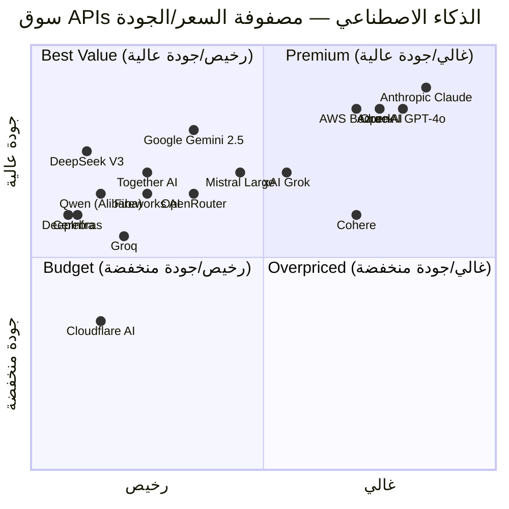
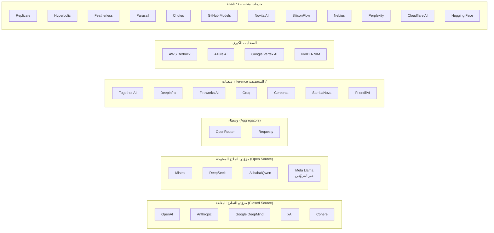
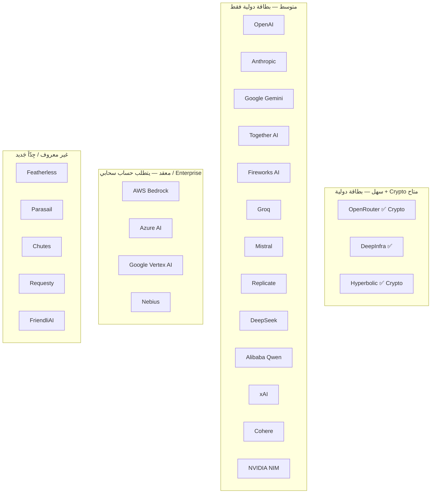

# تحليل سوق الذكاء الاصطناعي العالمي — المزوّدون وأسواق الـ API
## Global AI Market & API Provider Analysis

**المشروع:** منصة AI عربية شاملة (AI Reseller Platform)
**التاريخ:** يوليو 2026 (تقديرات منتصف 2025)
**سعر الصرف المرجعي:** 1 دولار ≈ 50 جنيهاً مصرياً (متغير)
**إخلاء مسؤولية:** كل الأسعار والأرقام تقديرات قابلة للتغير

---

## جدول المحتويات

1. [ملخص تنفيذي](#1-ملخص-تنفيذي)
2. [منهجية التحليل](#2-منهجية-التحليل)
3. [بطاقات تحليل المزوّدين](#3-بطاقات-تحليل-المزوّدين)
   - 3.1 OpenAI
   - 3.2 Anthropic (Claude)
   - 3.3 Google (Gemini API + Vertex AI)
   - 3.4 Mistral (La Plateforme)
   - 3.5 xAI (Grok)
   - 3.6 DeepSeek
   - 3.7 Alibaba Cloud (Qwen / Model Studio)
   - 3.8 Cohere
   - 3.9 Perplexity (Sonar API)
   - 3.10 OpenRouter
   - 3.11 Together AI
   - 3.12 DeepInfra
   - 3.13 Fireworks AI
   - 3.14 Groq
   - 3.15 Nebius (formerly Nebius AI)
   - 3.16 SiliconFlow
   - 3.17 Novita AI
   - 3.18 Replicate
   - 3.19 Hugging Face (Inference Providers & Endpoints)
   - 3.20 Cerebras
   - 3.21 Lambda (Lambda Labs)
   - 3.22 AWS Bedrock
   - 3.23 Azure AI (Azure OpenAI Service / AI Foundry)
   - 3.24 Cloudflare Workers AI
   - 3.25 NVIDIA NIM (build.nvidia.com)
   - 3.26 Hyperbolic
   - 3.27 SambaNova
   - 3.28 Featherless
   - 3.29 Parasail
   - 3.30 Chutes
   - 3.31 GitHub Models
   - 3.32 Requesty
   - 3.33 FriendliAI
4. [خريطة تصنيف السوق](#4-خريطة-تصنيف-السوق)
5. [جداول مقارنة شاملة](#5-جداول-مقارنة-شاملة)
6. [دراسة حالة: OpenRouter](#6-دراسة-حالة-openrouter)
7. [استراتيجية المورّدين الموصى بها لمنصتنا](#7-استراتيجية-المورّدين-الموصى-بها)
8. [مصادر ومراجع للتحقق](#8-مصادر-ومراجع-للتحقق)

---

## 1. ملخص تنفيذي

سوق APIs الذكاء الاصطناعي العالمي يشهد انفجاراً غير مسبوق. مع نهاية 2025، تجاوزت قيمة سوق نماذج اللغة الكبيرة (LLMs) كخدمة $30 مليار سنوياً، مع توقعات نمو سنوي مركب (CAGR) يتجاوز 35% حتى 2030. المشهد يضم أكثر من 30 مزوّداً رئيسياً يقدمون APIs للاستدلال (Inference) بتفاوت هائل في الأسعار والسرعات والجودة وشروط الاستخدام.

**الفرصة:** لا يوجد لاعب عربي يجمع كل هؤلاء المزوّدين في منصة واحدة، بفوترة محلية (EGP/Paymob/Fawry) وواجهة عربية. السوق المصري وحده يضم ~3-5 ملايين مطور ومستخدم تقني يدفعون أضعاف السعر العالمي بسبب الدولار ورسوم البطاقات.

**التوصية الجوهرية:** الاعتماد على OpenRouter كوسيط (Aggregator) رئيسي للمرحلة الأولى (يوفر 200+ نموذج بفاتورة واحدة بدون عقود معقدة)، مع توسع تدريجي نحو مزوّدي Tier-1 (OpenAI, Anthropic, Google) للمستخدمين المتميزين، ومزوّدي Tier-2 (DeepInfra, Together, Groq) للأسعار المنخفضة.

---

## 2. منهجية التحليل

تم تحليل كل مزوّد وفق 19 معياراً:

1. **التاريخ والتأسيس والتمويل:** متى تأسس، من المؤسسون، جولات التمويل
2. **نموذج العمل:** Pay-as-you-go, اشتراكات، Enterprise
3. **التسعير:** أسعار حقيقية تقريبية لأشهر النماذج (لكل مليون token)
4. **نقاط القوة:** Competitive Advantages
5. **نقاط الضعف:** Weaknesses
6. **جودة API واستقراره:** Uptime, Errors, Rate Limits handling
7. **السرعة (TTFT & Tokens/s):** Time To First Token, Throughput
8. **قابلية التوسع:** Scale-out capabilities
9. **الطبقة المجانية:** Free Tier
10. **سياسة إعادة البيع / الاستخدام التجاري:** هل ToS تسمح ببناء منصة فوق المزوّد؟
11. **التكاليف الخفية:** رسوم إضافية، minimum spend
12. **حدود المعدل:** Rate Limits
13. **زمن الاستجابة والتأثير على مصر:** Latency, Server locations
14. **التوفر / SLA:** Uptime guarantees
15. **العملاء المستهدفون:** Target segments
16. **الربحية والوضع المالي:** Financial health
17. **خارطة الطريق المستقبلية:** Roadmap
18. **مدى الصلاحية كمورّد خلفي لمنصتنا:** تقييم 1-10
19. **سهولة الدفع من مصر:** Payability

---

## 3. بطاقات تحليل المزوّدين

---

### 3.1 OpenAI

| المعيار | التحليل |
|---------|---------|
| **التاريخ والتأسيس والتمويل** | تأسست 2015 كمنظمة غير ربحية، تحولت إلى "محدودة الربح" 2019. المؤسسون: Sam Altman, Greg Brockman, Ilya Sutskever, Elon Musk (انسحب). التمويل التراكمي: ~$20B+ (Microsoft ~$13B, Thrive Capital, Tiger Global, Sequoia). تقييم آخر جولة: ~$150-300B (2025). |
| **نموذج العمل** | Pay-as-you-go عبر API + اشتراكات ChatGPT Plus/Pro/Team/Enterprise. أسعار متدرجة حسب النموذج. خصومات للاستخدام المرتفع (Tier-based). |
| **التسعير** | GPT-4o: $2.50/$10 (input/output لكل مليون token). GPT-4o-mini: $0.15/$0.60. GPT-4.1: $2/$8. o3: ~$10/$40. o4-mini: ~$1.10/$4.40. DALL-E 3: $0.04/image. Whisper: $0.006/minute. TTS: $15/1M characters. |
| **نقاط القوة** | نموذج GPT-4o الأفضل تعدد الوسائط (vision + text + audio). مجتمع ضخم. وثائق ممتازة. استقرار عالٍ. ابتكار مستمر. سلسلة o1/o3/o4 للاستدلال (Reasoning). |
| **نقاط الضعف** | الأسعار مرتفعة جداً مقارنة بالبديل. إغلاق المنصة (Closed Source). رقابة وفلترة عالية (Safety Moderation). تغييرات مفاجئة في ToS. سياسات خصوصية مثيرة للجدل. |
| **جودة API واستقراره** | ممتاز بشكل عام — uptime >99.9%. أخطاء 429 (Rate Limit) متكررة في الاستخدام العالي. زمن معالجة الطلبات بطيء في أوقات الذروة. |
| **السرعة** | GPT-4o: TTFT ~300-800ms, throughput ~30-80 t/s. o3: TTFT ~2-10s (للاستدلال العميق). GPT-4o-mini: ~100-300ms, ~100-200 t/s. |
| **قابلية التوسع** | ممتازة — بنية Microsoft Azure التحتية. آلاف الطلبات في الثانية. |
| **الطبقة المجانية** | $5 مجاني لحسابات API الجديدة (مدة صلاحية 3 أشهر). ChatGPT مجاني مع GPT-4o-mini. |
| **سياسة إعادة البيع** | ToS تسمح بإعادة البيع عبر API مع شروط: لا تحريف للمخرجات، لا استخدام للتنافس مع OpenAI، إفشاء للمستخدمين بأنهم يتفاعلون مع AI. متطلبات Compliance مشددة. |
| **التكاليف الخفية** | رسوم Fine-tuning (تدريب). رسوم التخزين Embeddings Vector Store. رسوم Moderation API الإجبارية لبعض الاستخدامات. تجاوز Rate Limits يضطرك لرفع Tier (يتطلب توثيق دفع). |
| **حدود المعدل** | Tier 1: 200 req/min (GPT-4o), 500 req/min (GPT-4o-mini). Tier 5: 10,000+ req/min. رفع الـ Tier يتطلب إنفاقاً تراكمياً ($5, $50, $250, $1K). |
| **زمن الاستجابة** | سيرفرات في US East (Virginia), US West, Europe (London, Stockholm), لا يوجد في الشرق الأوسط. متوسط latency من مصر: ~200-400ms أساسي + وقت المعالجة. |
| **التوفر / SLA** | لا يوجد SLA مضمون في الخطة الأساسية. Enterprise agreements توفر 99.9%. |
| **العملاء المستهدفون** | الشركات الكبرى، المؤسسات الناشئة الممولة، الباحثون، المطورون الأفراد. |
| **الربحية والوضع المالي** | ليست مربحة بعد (خسائر ~$5B في 2024). لكن الإيرادات ~$8B+ (2025) وتنمو بسرعة. Microsoft تدعم. |
| **خارطة الطريق** | GPT-5 (تعدد وسائط كامل)، أدوات Agent (Operator)، نماذج Reasoning أسرع، تخفيض الأسعار تدريجياً، توسع في Enterprise. |
| **الصلاحية كمورّد خلفي** | **6/10** — ممتاز للجودة والاستقرار لكن السعر مرتفع وشروط إعادة البيع مقيدة وخطر الاعتماد على مزوّد واحد. مناسب لمستخدمي "Premium" في منصتنا بهامش ربح قليل (15-20%). |
| **الدفع من مصر** | ✅ يقبل بطاقات الائتمان الدولية (Visa/Mastercard) والـ PayPal. ❌ لا يدعم Fawry أو Paymob أو InstaPay. مشكلة في بطاقات借记 المصدرة من بنوك مصرية (Egyptian debit cards قد ترفض). حل بديل: PayPal أو حساب USD دولي. |

---

### 3.2 Anthropic (Claude)

| المعيار | التحليل |
|---------|---------|
| **التاريخ والتأسيس والتمويل** | تأسست 2021 من منشقين عن OpenAI (Dario Amodei, Daniela Amodei). التمويل: ~$10B+ (Google ~$3B, Amazon ~$4B, Spark Capital, Menlo Ventures). تقييم 2025: ~$60B. |
| **نموذج العمل** | API Pay-as-you-go + Claude.ai Pro/Team/Enterprise (اشتراكات $20-100/شهر + Enterprise حسب الطلب). |
| **التسعير** | Claude Opus 4 (Sonnet 4?): ~$15/$75 (input/output لكل مليون token). Claude Sonnet 4: ~$3/$15. Claude Haiku (صوري): $0.25/$1.25. Claude 3.5 Sonnet: $3/$15. |
| **نقاط القوة** | أفضل نماذج في الـ Reasoning الآمن (Safety). مخرجات أقل هلوسة. نافذة سياق ضخمة (200K tokens في Haiku, كلود الجديد قد يصل 500K). توثيق ممتاز للـ System Prompts. تكامل مع الأمازون (Bedrock). |
| **نقاط الضعف** | أغلى من المنافسين. غير متعدد الوسائط بنفس قوة GPT-4o (صور وPDF فقط). السرعة أقل من Groq/DeepInfra. السياسات الرقابية ثقيلة. |
| **جودة API واستقراره** | جيد جداً لكن أقل من OpenAI. أعطال متفرقة (خاصة في 2024). استجابة للـ Support بطيئة في Tier المنخفضة. |
| **السرعة** | Claude Sonnet 4: TTFT ~400-600ms, ~40-70 t/s. Claude Opus: TTFT ~800-1500ms, ~20-40 t/s. |
| **قابلية التوسع** | جيدة — لكن ليست بمستوى OpenAI. تعتمد على بنيتها الخاصة + AWS. |
| **الطبقة المجانية** | لا يوجد Free Tier لمطوري API مباشرة. Claude.ai مجاني مع حدود يومية. |
| **سياسة إعادة البيع** | ToS تسمح بإعادة البيع "بشروط". تمنع صراحة: استخدام المخرجات لتدريب نماذج منافسة، التظاهر بأن المخرجات بشرية ("Human-like" deception). الأفضل مراجعة ToS للنسخة المحدثة. |
| **التكاليف الخفية** | تكلفة الـ Context Window الطويل جداً (Sonnet: $3/1M لكل مليون token وللـ output $15 = إذا أرسلت 100K token ستدفع ~$0.3 لكل طلب). |
| **حدود المعدل** | Tier 1: 5 req/min (Opus), 50 req/min (Sonnet). Tier 4: 5,000 req/min — يتطلب إنفاق $10K+. |
| **زمن الاستجابة** | سيرفرات في US (Oregon, Virginia) + Europe (London). من مصر latency ~250-500ms. |
| **التوفر / SLA** | لا يوجد SLA عام. Enterprise بعقود مخصصة. |
| **الربحية والوضع المالي** | غير مربحة. إيرادات ~$2B (2025 متوقع). Google وAmazon يدعمان بقوة. |
| **خارطة الطريق** | Claude 4 multimodal الكامل، ميزات Agent (Computer Use)، تخفيض أسعار متوقع، تدريب نموذج أكبر وأرخص. |
| **الصلاحية كمورّد خلفي** | **5/10** — ممتاز للجودة لكن غالي جداً وشروط صارمة. مناسب فقط لخط "Premium Ultra" بهامش ربح 10-15%. |
| **الدفع من مصر** | ✅ بطاقات ائتمان دولية، PayPal. ❌ لا بوابات مصرية. نفس مشكلة OpenAI. |

---

### 3.3 Google — Gemini API & Vertex AI

| المعيار | التحليل |
|---------|---------|
| **التاريخ والتأسيس والتمويل** | Google DeepMind (دمج Google Brain + DeepMind 2023). Gemini API أُطلق ديسمبر 2023. Google: شركة عامة بقيمة سوقية ~$2T+. |
| **نموذج العمل** | Gemini API: Pay-as-you-go من AI Studio (ai.google.dev). Vertex AI: منصة GCP كاملة مع SLA Enterprise. خصومات للاستخدام المرتفع. |
| **التسعير** | Gemini 2.5 Pro: $1.25-$2.50/$5-$10 (input/output لكل مليون token، يعتمد على طول السياق). Gemini 2.5 Flash: $0.15/$0.60. Gemini 2.0 Flash: $0.10/$0.40. خصم 50% على السياقات الأقل من 128K. Imagen 3: $0.03/image. |
| **نقاط القوة** | الأرخص بين Tier-1. نافذة سياق 1M+ tokens (الأطول في السوق). تكامل مع منتجات Google. بنية تحتية عالمية. تعدد وسائط قوي. Context Caching لتقليل التكاليف. |
| **نقاط الضعف** | API متقلب أحياناً. نماذج تغير تسميتها كثيراً (مربكة). جودة الـ Reasoning أقل من Claude في بعض المهام. دعم فني ممتاز فقط مع Google Cloud (اشتراك Enterprise). |
| **جودة API واستقراره** | جيد جداً — uptime ~99.9%. لكن تغييرات مفاجئة في الموديلات مما يكسر التكامل. |
| **السرعة** | Gemini 2.5 Flash: TTFT ~200-400ms, throughput ~150-300 t/s (سريع جداً). Gemini 2.5 Pro: ~400-800ms, ~50-80 t/s. |
| **قابلية التوسع** | ممتازة — بنية Google التحتية. |
| **الطبقة المجانية** | **Free Tier للـ API!** (محدود بـ 60 req/min لـ Gemini 1.5 Flash و 10 req/min لـ Pro). هذا فريد ومفيد جداً للاختبار. |
| **سياسة إعادة البيع** | ToS متساهلة نسبياً — تسمح بإعادة البيع مع قيود قليلة (يحظر فقط الاستخدامات الخطيرة والتدريب التنافسي). الأفضل بين الكبار! |
| **التكاليف الخفية** | Vertex AI له تكلفة إضافية للبنية التحتية (GCP). Context Caching له سعر تخزين إضافي ($0.01/1M tokens/ساعة). |
| **حدود المعدل** | Gemini API: 1,500 req/day (Pro مجاني)، آلاف req/min في المدفوع. Vertex AI: مرن يعتمد على GCP Quota. |
| **زمن الاستجابة** | **سيرفرات في قطر!** (Doha, Meus-east). هذا قريب جداً من مصر — ~40-80ms إضافية. أفضل latency لمصر. |
| **التوفر / SLA** | Vertex AI: 99.9% SLA. Gemini API العادي: لا SLA مضمون. |
| **الربحية والوضع المالي** | Google Cloud يحقق أرباحاً. AI Cloud أعمال تنمو بسرعة ~$40B+. |
| **خارطة الطريق** | Gemini 3 (تخطيط)، نماذج Agent ذاتية، Video Generation (Veo 3 بالكامل)، تخفيض أسعار مستمر. |
| **الصلاحية كمورّد خلفي** | **8/10** — سعر ممتاز، Free Tier، سياسة متساهلة، أقرب سيرفر (قطر). مناسب لـ "Mid-Tier" و "Budget" في منصتنا. |
| **الدفع من مصر** | ✅ بطاقات دولية، PayPal, Google Pay. كما يمكن الفوترة عبر Google Cloud (فواتير رسمية تقبل محلياً). قد يعمل مع InstaPay غير مباشر. |

---

### 3.4 Mistral AI — La Plateforme

| المعيار | التحليل |
|---------|---------|
| **التاريخ والتأسيس والتمويل** | تأسست في فرنسا 2023 (Arthur Mensch, Guillaume Lample, Timothée Lacroix). التمويل: ~€1B+ (€105M Seed + €385M Series A + €600M Series B بتقييم €6B). |
| **نموذج العمل** | La Plateforme: API Pay-as-you-go + اشتراكات Le Chat + Enterprise (مع النشر الخاص). نماذج مفتوحة المصدر (Apache 2.0 → خطة مجتمعية). |
| **التسعير** | Mistral Large 3: $2/$6 (input/output لكل مليون token). Mistral Small 3: $0.2/$0.6. Ministral 3B: $0.04/$0.04. Mistral Embed: €0.07/1M tokens. Codestral (توليد كود): $1/$3. |
| **نقاط القوة** | نماذج مفتوحة المصدر (تدفع Github/Mistral المجتمع). دعم ممتاز للفرنسية والأوروبية (والعربية جيد). الابتكار في الموديلات الصغيرة (Ministral, Codestral). إيثوس الخصوصية الأوروبي (GDPR). |
| **نقاط الضعف** | جودة نماذجها أقل بقليل من GPT/Claude. قاعدة المستخدمين أصغر. لا تعدد وسائط قوي (نصوص فقط plus صور محدود). سرعة أقل من المنافسين. |
| **جودة API واستقراره** | جيد — لكن أقل نضجاً من الكبار. أخطاء متفرقة. |
| **السرعة** | Mistral Large: TTFT ~500-1000ms, ~30-50 t/s. Mistral Small: ~200-400ms, ~80-120 t/s. |
| **قابلية التوسع** | متوسطة — تحتاج حجز capacity للأحجام الكبيرة. |
| **الطبقة المجانية** | نعم — $1M مجاني (لا أتذكر المبلغ بدقة لكنها رصيد تجريبي ~€20 مجاني). Le Chat مجاني (بلا حدود معلنة). |
| **سياسة إعادة البيع** | متساهلة جداً — نماذج Apache 2.0 يمكن استخدامها بأي شكل. نماذج التجارية: ToS تسمح بإعادة البيع بدون عوائق كبيرة. |
| **التكاليف الخفية** | لا توجد واضحة. |
| **حدود المعدل** | 50 req/min للـ API المجاني. مرتفع جداً في المدفوع. |
| **زمن الاستجابة** | سيرفرات في فرنسا + US + UK. من مصر ~150-300ms. |
| **التوفر / SLA** | لا SLA مضمون. Enterprise بعقود. |
| **الربحية والوضع المالي** | مرحلة ما قبل الربحية. تمويل قوي. |
| **خارطة الطريق** | نماذج Multimodal (Pixtral)، Mistral Large 4، توسع في السحابة الأوروبية. |
| **الصلاحية كمورّد خلفي** | **7/10** — سعر جيد جداً، سياسة متساهلة، نماذج كود ممتازة (Codestral). مناسب كخط Baseline و Budget. |
| **الدفع من مصر** | ✅ بطاقات دولية، PayPal. |

---

### 3.5 xAI (Grok)

| المعيار | التحليل |
|---------|---------|
| **التاريخ والتأسيس والتمويل** | تأسست 2023 من Elon Musk. تقييم ~$40B+ (2025). تمويل ~$6B من مستثمرين. |
| **نموذج العمل** | API (xAI API) + X Premium+ ($16/شهر يتضمن Grok) + Enterprise. |
| **التسعير** | Grok 3: ~$2/$8 (input/output لكل مليون token). Grok 3 mini: ~$0.30/$1.20. أرخص من OpenAI لكن أغلى من ميتشرل. |
| **نقاط القوة** | تكامل مع منصة X (Twitter). نموذج Reasoning قوي. وصول لبيانات X في الزمن الحقيقي. Elon Musk قوة تسويقية هائلة. |
| **نقاط الضعف** | API غير ناضج — وثائق محدودة، Cutoff مبكر، ميزات قليلة. جدل سياسي حول المنصة. قلة النماذج المدعومة. |
| **جودة API واستقراره** | متوسط — تغييرات متكررة، أعطال. |
| **السرعة** | Grok 3: TTFT ~500-700ms, ~40-60 t/s. |
| **قابلية التوسع** | متوسطة — تتحسن. |
| **الطبقة المجانية** | مجاني عبر X (للجميع حدود يومية). API: لا Free Tier. |
| **سياسة إعادة البيع** | تسمح ToS بإعادة البيع مع قيود: لا للاستخدام السياسي، لا للإساءة، لا للتدريب التنافسي. |
| **التكاليف الخفية** | غير واضحة بعد. |
| **حدود المعدل** | محدودة — 60 req/min في البداية. |
| **زمن الاستجابة** | سيرفرات في US. من مصر ~250-400ms. |
| **التوفر / SLA** | لا يوجد. |
| **الربحية والوضع المالي** | غير مربحة. ممولة من Elon شخصياً (طرح $1B إضافي 2024). |
| **خارطة الطريق** | Grok 4، API أكثر نضجاً، توسع في AI Video. |
| **الصلاحية كمورّد خلفي** | **4/10** — API غير ناضج، غير موثوق، تقييدات. مناسب كإضافة "Grok" للمستخدمين المهتمين فقط. |
| **الدفع من مصر** | ✅ بطاقات دولية (Stripe). |

---

### 3.6 DeepSeek (الرسمي)

| المعيار | التحليل |
|---------|---------|
| **التاريخ والتأسيس والتمويل** | شركة صينية تابعة لـ High-Flyer Quant (صندوق تحوط). بـ $14M فقط (!) — أحد أشهر قصص الـ Efficiency في 2024-2025. التأسيس: 2023. القيادة: Liang Wenfeng. |
| **نموذج العمل** | API Pay-as-you-go بسعر شبه رمزي. استراتيجية "Subsidized Pricing" لبناء حصة سوقية. |•  
| **التسعير** | **DeepSeek V3: $0.27/$1.10** (input/output لكل مليون token — أرخص بكثير من GPT-4o). DeepSeek R1: $0.55/$2.19 (Reasoning). DeepSeek R1 Distill (المقطر): أرخص. Chat: مجاني تماماً. |
| **نقاط القوة** | الثمن خرافي رخيص. جودة ممتازة مقارنة بالسعر. نموذج مفتوح المصدر (MIT License). دعم سياق طويل (1M tokens). كود مفتوح يسمح بالنشر الذاتي. |
| **نقاط الضعف** | **شركة صينية** — مشاكل Privacy كبيرة للمستخدمين المصريين/الغربين. عرضة للعقوبات الأمريكية. اندفاع الطلب يسبب ضغطاً على السيرفرات. رقابة صينية على المحتوى. API بطيء أحياناً (ازدحام). |
| **جودة API واستقراره** | متقلبة — في أوقات الذروة تظهر أخطاء 524/503. لكنها تتحسن. |
| **السرعة** | DeepSeek V3: TTFT ~400-800ms, ~60-100 t/s. R1 (Reasoning): TTFT ~2000-5000ms. |
| **قابلية التوسع** | جيدة داخل الصين — لكن أحمال API ترتفع وتنخفض بشدة. |
| **الطبقة المجانية** | **Chat مجاني بالكامل** — بلا حدود معلنة (أفضل Free Tier بين المزوّدين). API: $0.5M مجاني للاشتراك الأول. |
| **سياسة إعادة البيع** | MIT License للنماذج المفتوحة — تسمح بأي شيء. API ToS تسمح بإعادة البيع مع قيود على "الإضرار بمصلحة الشركة". غامضة بعض الشيء. |
| **التكاليف الخفية** | لا توجد — التسعير شفاف. |
| **حدود المعدل** | 500 req/min عموماً — لكن يختلف. |
| **زمن الاستجابة** | سيرفرات في الصين (Guangdong, Beijing). من مصر ~200-400ms. قد يكون محظوراً أو مبطئاً من بعض مزوّدي الخدمة في مصر. |
| **التوفر / SLA** | لا يوجد SLA. |
| **الربحية والوضع المالي** | خسائر على الـ API (أسعار مدعومة). High-Flyer يمول الخسائر. قد ترفع الأسعار لاحقاً. |
| **خارطة الطريق** | DeepSeek V4، R2، تطوير نماذج Multimodal. التوسع خارج الصين. |
| **الصلاحية كمورّد خلفي** | **9/10 للتسعير، 4/10 للثقة** — السعر لا يقاوم لكن المخاطر السياسية والـ Privacy عالية. استراتيجية: استخدام DeepSeek عبر OpenRouter (يخفي المصدر ويوفر طبقة توثيق نظيفة) بدلاً من API المباشر. |
| **الدفع من مصر** | ✅ Stripe (بطاقات دولية). لكن التحويل المباشر للصين قد يكون معقداً. عبر OpenRouter: نفس سهولة أي حساب Stripe. |

---

### 3.7 Alibaba Cloud — Qwen / Model Studio

| المعيار | التحليل |
|---------|---------|
| **التاريخ والتأسيس والتمويل** | Alibaba Group (NYSE: BABA, HK: 9988) — شركة صينية مدرجة بقيمة ~$250B+. Qwen: نموذج مفتوح أطلق 2023. Model Studio: منصة API. |
| **نموذج العمل** | API Pay-as-you-go عبر Model Studio + Alibaba Cloud BaiLian + اشتراكات Enterprise. |
| **التسعير** | Qwen-Max (أفضل): ~$0.80/$2.40 (input/output لكل مليون token). Qwen-Plus: ~$0.20/$0.60. Qwen-Turbo: ~$0.08/$0.16. Qwen2.5-Coder: ~$0.20/$0.60. |
| **نقاط القوة** | رخيص جداً. دعم ممتاز للعربية (أفضل من GPT لبعض المهام العربية). نماذج مفتوحة (Apache 2.0). إيكوسيستم Alibaba السحابي. تنوع نماذج (Coder, Math, VL). |
| **نقاط الضعف** | شركة صينية (مخاوف خصوصية). تسجيل الحساب يتطلب توثيقاً صارماً. الواجهة صينية/إنجليزية فقط. الدعم الفني صيني بشكل أساسي. |
| **جودة API واستقراره** | جيد — Alibaba سحابة ناضجة. |
| **السرعة** | Qwen-Plus: TTFT ~200-400ms, ~100-150 t/s. |
| **قابلية التوسع** | ممتازة — Alibaba Cloud infrastructure. |
| **الطبقة المجانية** | نعم — Model Studio يعطي رصيد تجريبي (حوالي ¥200 = ~$28). |
| **سياسة إعادة البيع** | ToS تسمح بإعادة البيع — لكن Alibaba Cloud لها عقود صارمة للـ Enterprise. |
| **التكاليف الخفية** | تكاليف تخزين البيانات على Alibaba Cloud إن احتجتها. |
| **حدود المعدل** | 200-500 req/min حسب النموذج. |
| **زمن الاستجابة** | سيرفرات في الصين + آسيا + US + Europe. من مصر ~200-350ms عبر US/Europe. |
| **التوفر / SLA** | 99.9% على Alibaba Cloud. |
| **الربحية والوضع المالي** | Alibaba عملاق ربحي ($25B+ أرباح 2024). AI قسم استثماري. |
| **خارطة الطريق** | Qwen 3، نماذج Agent-Multimodal أوسع. |
| **الصلاحية كمورّد خلفي** | **7/10** — ممتاز للعربية، رخيص، سياسة مرنة. مناسب لكخط "Budget Plus" و "Arabic-Optimized". |
| **الدفع من مصر** | ✅ بطاقات دولية، PayPal. ❌ لا بوابات مصرية. |

---

### 3.8 Cohere

| المعيار | التحليل |
|---------|---------|
| **التاريخ والتأسيس والتمويل** | تأسست 2019 من Aidan Gomez وآخرين (مؤلفو ورقة "Attention Is All You Need"). التمويل: ~$500M+ (Tiger Global, Index Ventures). تقييم ~$3B. |
| **نموذج العمل** | Enterprise-first — مبيعات مباشرة للشركات (Contracts). API عام مع Pay-as-you-go. تخصص في RAG (Retrieval Augmented Generation). |
| **التسعير** | Command R+: $2.50/$10 (input/output لكل مليون token). Command R: $0.50/$1.50. Embed (v3): $0.10/1M. Rerank: $2/1K (أغلى لكن ممتاز). |
| **نقاط القوة** | تخصص في Enterprise RAG. نموذج Rerank الأفضل في السوق. دعم متعدد اللغات (100+ لغة بينها العربية). أمان وخصوصية للمؤسسات. |
| **نقاط الضعف** | أسعار مرتفعة. نماذج للأغراض العامة ليست تنافس GPT/Claude. قاعدة مستخدمين صغيرة نسبياً. |
| **جودة API واستقراره** | جيد جداً — uptime عالٍ. |
| **السرعة** | Command R+: TTFT ~500-800ms, ~30-50 t/s. |
| **قابلية التوسع** | جيدة — بنية سحابية خاصة. |
| **الطبقة المجانية** | نعم — 5M tokens مجاناً في التجربة (أو Trail API key بمحدودية). |
| **سياسة إعادة البيع** | ToS تسمح بإعادة البيع — لكن مع قيود أكثر من الكبار (لأنهم شركة Enterprise بالأساس). |
| **التكاليف الخفية** | رسوم الـ Rerank مرتفعة جداً إذا استخدمته بكثافة. |
| **حدود المعدل** | 100 req/min في الخطة المجانية. |
| **زمن الاستجابة** | سيرفرات في US + Europe. من مصر ~200-400ms. |
| **التوفر / SLA** | 99.9% للـ Enterprise. |
| **الربحية والوضع المالي** | غير مربحة — مرحلة نمو. |
| **خارطة الطريق** | Command R++ (Coral? لم يعلن رسمياً)، دمج RAG أعمق مع Enterprise workflows. |
| **الصلاحية كمورّد خلفي** | **4/10** — أغلى ثمناً وأقل جودة عامة. مفيد فقط لميزات RAG/Search المتخصصة في منصتنا. |
| **الدفع من مصر** | ✅ بطاقات دولية. |

---

### 3.9 Perplexity — Sonar API

| المعيار | التحليل |
|---------|---------|
| **التاريخ والتأسيس والتمويل** | تأسست 2022 من Aravind Srinivas وآخرون (خبراء سابقون في Google, OpenAI). التمويل: ~$200M+ (IVP, NEA). تقييم ~$3B. |
| **نموذج العمل** | اشتراكات Perplexity Pro/Enterprise ($20/شهر). Sonar API: Pay-as-you-go + Enterprise (بحث/فهرسة). |
| **التسعير** | Sonar Pro (بحث مع استشهادات): $2/$8 لكل مليون token أو على أساس الـ Query. Sonar (بحث بسيط): أرخص. أسعار الـ API غير مستقرة وقد تتغير. |
| **نقاط القوة** | بحث محسّن مع استشهادات (مصادر). دمج RAG أصيل. واجهة مستخدم جميلة. |
| **نقاط الضعف** | API جديد نسبياً — غير ناضج. تسعير غير شفاف كلياً. أدوات تطوير قليلة. |
| **جودة API واستقراره** | متوسط — تحسين مستمر. |
| **السرعة** | Sonar Pro: TTFT ~500-1500ms (يعتمد على عدد المصادر). |
| **قابلية التوسع** | متوسطة. |
| **الطبقة المجانية** | Perplexity مجاني (بحث عام). API: لا Free Tier واضح. |
| **سياسة إعادة البيع** | ToS تسمح بإعادة البيع لكن بقيود على الاستخدام. |
| **التكاليف الخفية** | البحث (Search queries) قد يكون له تكلفة منفصلة عن API الخاصة بالنموذج. |
| **حدود المعدل** | محدودة على الـ Free — غير معلنة بوضوح للمدفوع. |
| **زمن الاستجابة** | سيرفرات في US. من مصر ~200-400ms. |
| **التوفر / SLA** | لا SLA مضمون. |
| **الربحية والوضع المالي** | غير مربحة — ممولة venture-backed. |
| **خارطة الطريق** | توسع API البحثي، دمج نماذج متعددة. |
| **الصلاحية كمورّد خلفي** | **5/10** — مفيد لميزة "البحث بالذكاء الاصطناعي" كميزة إضافية في منصتنا. ليس كمزود أساسي. |
| **الدفع من مصر** | ✅ بطاقات دولية (Stripe). |

---

### 3.10 OpenRouter (دراسة حالة مفصلة في القسم 6)

| المعيار | التحليل |
|---------|---------|
| **التاريخ والتأسيس والتمويل** | تأسست ~2023. شركة خاصة — لم تفصح عن التمويل بوضوح. فريق صغير (~10-20 شخص). لا جولات تمويل كبيرة معلنة. |
| **نموذج العمل** | وسيط (Aggregator) API — يشتري بالجملة من 200+ مزوّد ويبيع بسعر مرتفع قليلاً (0-20% markup). يقبل الودائع (Prepaid credits) والفوترة الشهرية. |
| **التسعير** | يضيف 0-15% على السعر الأصلي (بعض النماذج بسعر التكلفة، بعضها بهامش). GPT-4o عبر OpenRouter: قد ترى $2.75/$11 (مقارنة $2.50/$10 الأصلي). DeepSeek V3: ~$0.30/$1.20. |
| **نقاط القوة** | **فاتورة واحدة — 200+ نموذج.** لا يحتاج حسابات متعددة. يعيد توجيه الطلبات تلقائياً عند فشل مزوّد (Fallback). سياسة متساهلة جداً مع البائعين. يمرّر CoT (Chain of Thought) للنماذج — خاصية نادرة. يوفر ميزات الإضافية: Provider Fallback, Prompt Caching, Retry on Error. |
| **نقاط الضعف** | خصوصية: يرى كل الطلبات (وكيل وسيط). قد يكون أغلى من الشراء المباشر بهامش 5-20%. لا تحكم كامل على اختيار المزوّد. استقرار: يعتمد على استقرار مزوّديه. |
| **جودة API واستقراره** | جيد — لكن يعتمد على الـ Upstream providers. أحياناً يعيد توجيهك لمزوّد أبطأ أو أسوأ. |
| **السرعة** | يعتمد على الـ Upstream provider المختار. بعض النماذج لها دعم Streaming. |
| **قابلية التوسع** | متوسطة — لا يوجد ضمان capacity للأحجام الكبيرة جداً (>10M طلب/شهر). |
| **الطبقة المجانية** | لا يوجد Free Tier مباشر. لكن $1 مبدئي يمكن شحنه. |
| **سياسة إعادة البيع** | **تسمح بإعادة البيع صراحة!** OpenRouter بني ليكون وسيطاً — يشجع الـ Resellers. |
| **التكاليف الخفية** | رسوم الفشل (Failed requests) تحتسب أحياناً. Provider Markup غير شفاف دائماً. |
| **حدود المعدل** | يعتمد على الـ Tier: $1/شهر → محدود. $100+/شهر → مرتفع. |
| **زمن الاستجابة** | OpenRouter يضيف ~50-100ms إضافية فوق الـ provider latency. سيرفرات في US + أوروبا. |
| **التوفر / SLA** | لا SLA. |
| **الربحية والوضع المالي** | نقطة تعادل (Break-even) أو ربح طفيف. شركة صغيرة. |
| **خارطة الطريق** | دمج المزيد من المزوّدين، تحسين ميزات التوجيه، إضافة نماذج جديدة فور إطلاقها. |
| **الصلاحية كمورّد خلفي** | **9/10** — مثالي للمرحلة الأولى للمشروع! فاتورة واحدة، 200+ نموذج، سياسة تسمح بإعادة البيع، لا عقود. |
| **الدفع من مصر** | ✅ بطاقات دولية (Stripe). ✅ يمكن الشحن بالـ Crypto (USDC, USDT). هذا مفيد للمصريين! الحل: اشحن $10-20 USDT أولاً. |

---

### 3.11 Together AI

| المعيار | التحليل |
|---------|---------|
| **التاريخ والتأسيس والتمويل** | تأسست 2022 (منشقون عن UC Berkeley). التمويل: ~$200M+ (Kleiner Perkins, Sequoia, NEA). تقييم ~$1.5B. |
| **نموذج العمل** | API للاستدلال (Inference) بنماذج مفتوحة المصدر + Fine-tuning + اشتراكات Dedicated Endpoints. |
| **التسعير** | Mixtral 8x22B: $0.80/$0.80. Llama 3.1 405B: $2/$2. Llama 3.3 70B: $0.88/$0.88. DeepSeek R1: $1.50/$1.50. معظم النماذج بتسعير متماثل (input = output). |
| **نقاط القوة** | النماذج المفتوحة الأسرع والأفضل أداءً. دعم ممتاز لـ Fine-tuning. بنية تحتية عالية (H100 clusters). مجتمع قوي. |
| **نقاط الضعف** | نماذج مغلقة غير متوفرة (OpenAI, Claude). أسعار بعض النماذج (مثل 405B) لا تزال مرتفعة. ازدحام أحياناً. |
| **جودة API واستقراره** | ممتاز — uptime ~99.9%. |
| **السرعة** | Mixtral 8x22B: ~100-150 t/s. Llama 405B: ~50-80 t/s. |
| **قابلية التوسع** | ممتازة — شبكة H100 كبيرة. |
| **الطبقة المجانية** | نعم — $25 رصيد مجاني للتجربة. |
| **سياسة إعادة البيع** | ToS تسمح بإعادة البيع مع شروط عامة. متساهلة نوعاً ما. |
| **التكاليف الخفية** | Dedicated endpoints لها رسوم اشتراك ثابتة ($1K+/شهر). |
| **حدود المعدل** | $25/شهر → 50 req/min، $100+/شهر → 500+ req/min. |
| **زمن الاستجابة** | سيرفرات في US (Oregon, Virginia). من مصر ~200-400ms. |
| **التوفر / SLA** | 99.9% للـ Endpoints المدفوعة. |
| **الربحية والوضع المالي** | غير مربحة بعد. |
| **خارطة الطريق** | توسع دولي، تحسين نماذج المفتوحة، دمج Agent. |
| **الصلاحية كمورّد خلفي** | **8/10** — ممتاز للنماذج المفتوحة والأسعار المنافسة. من أفضل مزوّدي Tier-2. |
| **الدفع من مصر** | ✅ بطاقات دولية. |

---

### 3.12 DeepInfra

| المعيار | التحليل |
|---------|---------|
| **التاريخ والتأسيس والتمويل** | شركة خاصة — تأسست ~2022. لا تمويل خارجي معلن كبير. فريق صغير. |
| **نموذج العمل** | Pay-as-you-go API — نماذج مفتوحة المصدر بتسعير منخفض جداً. لا خطط Enterprise معقدة. |
| **التسعير** | **الأرخص في السوق عموماً!** Llama 3.1 70B: $0.25/$0.50. Llama 3.3 70B: $0.28/$0.70. Mixtral 8x22B: $0.25/$0.50. Qwen 2.5 72B: $0.15/$0.35. Qwen 2.5 Coder 32B: $0.08/$0.15. DeepSeek V3: $0.20/$0.50. |
| **نقاط القوة** | أرخص مزوّد في السوق. واجهة بسيطة. يستضيف أحدث النماذج المفتوحة بسرعة. دعم لـ Tool Calling و Function Calling. |
| **نقاط الضعف** | لا نماذج مغلقة. قلة ميزات (لا Fine-tuning، لا Dedicated). استقرار يعتمد على الأحمال. فريق صغير — دعم محدود. |
| **جودة API واستقراره** | جيد — لكن أحياناً 503 عند الازدحام. |
| **السرعة** | Llama 3.1 70B: ~70-120 t/s. Qwen 2.5 32B: ~150-200 t/s. |
| **قابلية التوسع** | متوسطة — يعتمد على توفر GPU. |
| **الطبقة المجانية** | لا يوجد. |
| **سياسة إعادة البيع** | ToS متساهلة جداً — تسمح بإعادة البيع صراحة. |
| **التكاليف الخفية** | لا تذكر. |
| **حدود المعدل** | متوسطة — غير معلنة بوضوح. |
| **زمن الاستجابة** | سيرفرات في US (California, Virginia). من مصر ~200-400ms. |
| **التوفر / SLA** | لا SLA. |
| **الربحية والوضع المالي** | غير معلنة — تبدو Break-even أو خسارة طفيفة (أسعار منخفضة جداً). |
| **خارطة الطريق** | تحسين السعة، إضافة موديلات جديدة. |
| **الصلاحية كمورّد خلفي** | **9/10** — السعر لا يقبل المنافسة. مثالي لخط "Budget Ultra" في منصتنا. استخدم مع Fallback (عبر OpenRouter). |
| **الدفع من مصر** | ✅ بطاقات دولية (Stripe). |

---

### 3.13 Fireworks AI

| المعيار | التحليل |
|---------|---------|
| **التاريخ والتأسيس والتمويل** | تأسست 2022 من مهندسين سابقين في Meta AI و Google. التمويل: ~$50M+ (Sequoia). |
| **نموذج العمل** | API (استدلال) + Fine-tuning + Fire Function (أدوات AI). |
| **التسعير** | Llama 3.1 405B: $1.20/$1.20. Llama 3.3 70B: $0.25/$0.50. Mixtral 8x7B: $0.05/$0.10. Mixtral 8x22B: $0.30/$0.60. DeepSeek R1: $1.50/$1.50. |
| **نقاط القوة** | سرعة عالية جداً (استخدام vLLM و TensorRT). دعم API محسّن لـ Function Calling. نموذج 405B رخيص نسبياً. |
| **نقاط الضعف** | مكتبة نماذج أقل من Together/DeepInfra. لا طبقة مجانية سخية. |
| **جودة API واستقراره** | ممتاز — uptime مرتفع. |
| **السرعة** | Llama 3.1 70B: ~150-200 t/s (سريع!). Mixtral 8x7B: 300+ t/s. |
| **قابلية التوسع** | جيدة — تتحسن. |
| **الطبقة المجانية** | نعم — $25 رصيد مجاني أو "Free tier" محدود (قيد التغيير). |
| **سياسة إعادة البيع** | ToS تسمح — متساهلة. |
| **التكاليف الخفية** | Fine-tuning له سعر إضافي ($X/ساعة تدريب). |
| **حدود المعدل** | 200 req/min في الخطة الأساسية. |
| **زمن الاستجابة** | سيرفرات في US. من مصر ~200-400ms. |
| **التوفر / SLA** | 99.9% للـ Enterprise. |
| **الربحية والوضع المالي** | غير معلنة. |
| **خارطة الطريق** | تحسين ميزات Function Calling، دمج نماذج أكثر. |
| **الصلاحية كمورّد خلفي** | **7/10** — ممتاز للسرعة ونماذج المفتوحة. |
| **الدفع من مصر** | ✅ بطاقات دولية. |

---

### 3.14 Groq

| المعيار | التحليل |
|---------|---------|
| **التاريخ والتأسيس والتمويل** | تأسست 2016 (Jonathan Ross — مخترع TPU في Google). التمويل: ~$700M+ (Tiger Global, D1 Capital). تقييم ~$3B+. |
| **نموذج العمل** | API للاستدلال باستخدام معالجات LPU (Language Processing Units) المخصصة. Free tier + Pay-as-you-go + Enterprise. |
| **التسعير** | Mixtral 8x7B: $0.24/$0.24. Llama 3.3 70B: $0.59/$0.79. Llama 3.1 405B: $2.38/$2.38. Gemma 2 9B: $0.10/$0.10. |
| **نقاط القوة** **سرعة فائقة!** (الأسرع في السوق — يصل إلى 500-2400 t/s). LPU المخصصة. مجتمع واسع (Free tier ساهم في انتشارها). |
| **نقاط الضعف** | نماذج محدودة (أغلبها مفتوحة المصدر، لا GPT/Claude). تسعير النماذج الكبيرة (405B) غالي على LPU. استقرار متقلب في أوقات الذروة. |
| **جودة API واستقراره** | جيد جداً — لكن Free tier أحياناً مشغول (429 errors). |
| **السرعة** | **2400 t/s لـ Llama 3.1 8B!** Mixtral 8x7B: ~500 t/s. Llama 70B: ~200 t/s. |
| **قابلية التوسع** | LPU لها سعة محدودة — تتوسع ببطء. |
| **الطبقة المجانية** | **ممتازة!** مجانية بالكامل (محدودة ~1000 req/day). لا يحتاج بطاقة ائتمان! |
| **سياسة إعادة البيع** | ToS تسمح — لكن قد تكون مقيدة للاستخدام التجاري الكثيف عبر Free tier. |
| **التكاليف الخفية** | LPU Dedicated endpoints $5K+/شهر. |
| **حدود المعدل** | Free tier: 30 req/min. مدفوع: 300 req/min. |
| **زمن الاستجابة** | سيرفرات في US (Virginia, California). من مصر ~200-400ms. |
| **التوفر / SLA** | 99.9% للمدفوع. |
| **الربحية والوضع المالي** | غير مربحة — مرحلة نمو. |
| **خارطة الطريق** | LPU الجيل الثاني، دعم نماذج أكبر، توسع عالمي. |
| **الصلاحية كمورّد خلفي** | **8/10** — ممتاز للسرعة و Free tier لاختبار النماذج. مناسب لـ "Turbo" و "Free" خطط في منصتنا. |
| **الدفع من مصر** | ✅ بطاقات دولية (Stripe). |

---

### 3.15 Nebius (الفورمير "Nebius AI" — سابقاً Yandex Cloud spin-off)

| المعيار | التحليل |
|---------|---------|
| **التاريخ والتأسيس والتمويل** | Nebius Group (NASDAQ: NBIS) — سبين أوف من Yandex N.V. ~$5B+ قيمة سوقية. AI Inference API جزء من Nebius Cloud. |
| **نموذج العمل** | سحابة عامة مع خدمات AI Inference + GPU rental + Dedicated endpoints. |
| **التسعير** | Llama 3.1 70B: $0.60/$0.80. Llama 3.1 405B: $1.80/$2.20. Mixtral 8x22B: $0.50/$0.70. Qwen 2.5: $0.40/$0.60. أسعار متوسطة. |
| **نقاط القوة** | بنية تحتية أوروبية (GDPR). استقرار عالٍ. GPU rental متاح. فواتير رسمية. |
| **نقاط الضعف** | أسعار ليست تنافسية كـ DeepInfra/Groq. نماذج محدودة. الوثائق بالإنكليزية فقط. |
| **جودة API واستقراره** | ممتاز — Yandex/Nebius بنية تحتية ناضجة. |
| **السرعة** | Llama 70B: ~60-100 t/s. |
| **قابلية التوسع** | ممتازة — سحابة أوروبية. |
| **الطبقة المجانية** | لا Free Tier للـ API AI (إلا رصيد سحابي عام). |
| **سياسة إعادة البيع** | ToS السحابية تسمح — لكن مع شروط Cloud العامة. |
| **التكاليف الخفية** | تكاليف نقل البيانات (Egress) خارج سحابة Nebius. |
| **حدود المعدل** | مرتفعة (سحابية). |
| **زمن الاستجابة** | سيرفرات في Europe (Finland, Netherlands). من مصر ~100-200ms (أقرب من US). |
| **التوفر / SLA** | 99.95% (سحابة). |
| **الربحية والوضع المالي** | شركة عامة — قسم AI استثماري. |
| **خارطة الطريق** | توسع APIs، دعم نماذج أكثر. |
| **الصلاحية كمورّد خلفي** | **6/10** — خيار أوروبي مستقر لـ Dedicated Enterprise. |
| **الدفع من مصر** | ✅ بطاقات دولية. تحويل بنكي دولي (Wire Transfer) للمبالغ الكبيرة. |

---

### 3.16 SiliconFlow

| المعيار | التحليل |
|---------|---------|
| **التاريخ والتأسيس والتمويل** | شركة صينية — تأسست ~2023. غير معلنة التمويل. موقعها: siliconflow.cn. |
| **نموذج العمل** | API Pay-as-you-go — متخصصة في النماذج المفتوحة (خصوصاً Qwen, DeepSeek). |
| **التسعير** | **رخيصة جداً** DeepSeek V3: $0.15/$0.30. Qwen-Plus: $0.10/$0.20. Llama 3.1 70B: $0.20/$0.40. |
| **نقاط القوة** | أرخص مزود لنماذ محددة. دعم ممتاز للنماذج الصينية. سرعة جيدة. |
| **نقاط الضعف** | واجهة صينية. الدعم بالصينية. مخاوف خصوصية (شركة صينية). وثائق API بالإنكليزية محدودة. |
| **جودة API واستقراره** | متوسط — جيد للاستخدام غير الحساس. |
| **السرعة** | DeepSeek V3: ~80-120 t/s. |
| **قابلية التوسع** | متوسطة. |
| **الطبقة المجانية** | رصيد تجريبي ~$10. |
| **سياسة إعادة البيع** | ToS صينية — غير واضحة كلياً بالإنكليزية. أتوقع متساهلة. |
| **التكاليف الخفية** | غير معروفة. |
| **حدود المعدل** | غير معلنة. |
| **زمن الاستجابة** | سيرفرات في الصين + آسيا. من مصر ~200-350ms. |
| **التوفر / SLA** | لا SLA. |
| **الربحية والوضع المالي** | غير معلنة. |
| **خارطة الطريق** | غير معروفة. |
| **الصلاحية كمورّد خلفي** | **6/10** — رخيص لكن مجهول. استخدم عبر OpenRouter بدلاً من المباشر. |
| **الدفع من مصر** | ✅ بطاقات دولية (Stripe عبر OpenRouter). المباشر: بطاقات أو Alipay. |

---

### 3.17 Novita AI

| المعيار | التحليل |
|---------|---------|
| **التاريخ والتأسيس والتمويل** | شركة صينية — تأسست ~2023. غير معلنة التمويل. |
| **نموذج العمل** | API Pay-as-you-go + GPU Cloud (استئجار GPUs). |
| **التسعير** | Llama 3.1 70B: $0.18/$0.36. Mixtral 8x22B: $0.25/$0.50. DeepSeek R1: $0.80/$1.60. Qwen 2.5 72B: $0.15/$0.30. رخيصة. |
| **نقاط القوة** | أسعار جيدة جداً. خدمة GPU Cloud للمطورين. نماذج متعددة. |
| **نقاط الضعف** | شركة صينية صغيرة. دعم محدود. توثيق ضعيف. واجهة صينية. |
| **جودة API واستقراره** | متوسط — أخطاء متقطعة. |
| **السرعة** | متوسطة — 40-100 t/s حسب النموذج. |
| **قابلية التوسع** | محدودة. |
| **الطبقة المجانية** | $0.5 رصيد ترحيبي (بسيط جداً). |
| **سياسة إعادة البيع** | غير واضحة — لكن نماذج مفتوحة. |
| **التكاليف الخفية** | GPU rental تكاليف مستقلة. |
| **حدود المعدل** | 30-100 req/min. |
| **زمن الاستجابة** | سيرفرات في الصين + US. من مصر ~200-400ms. |
| **التوفر / SLA** | لا. |
| **الربحية والوضع المالي** | غير معلنة. |
| **خارطة الطريق** | غير معروفة. |
| **الصلاحية كمورّد خلفي** | **5/10** — رخيص لكن لا ثقة. استخدم عبر OpenRouter. |
| **الدفع من مصر** | ✅ بطاقات دولية. |

---

### 3.18 Replicate

| المعيار | التحليل |
|---------|---------|
| **التاريخ والتأسيس والتمويل** | تأسست 2019 (YC W20). التمويل: ~$50M+ (Andreessen Horowitz, YC). |
| **نموذج العمل** | سوق (Marketplace) لنماذج AI — المستخدمون ينشرون نماذجهم و Replicate يستضيفها ويشارك الإيرادات. API Pay-as-you-go. |
| **التسعير** | **متخصصة في نماذج الصور/الفيديو/الصوت** أكثر من النصوص. Llama 3.3 70B: $0.55/$0.75. Stable Diffusion 3.5: $0.035/image. Flux: $0.02/image. |
| **نقاط القوة** | أكبر سوق لنماذج AI (100K+ model). متعددة الوسائط ممتازة. جودة عالية لنماذج الصور. |
| **نقاط الضعف** | أسعار نصوصها أعلى من المخصصة (DeepInfra/Together). التحكم في النماذج محدود. |
| **جودة API واستقراره** | جيد جداً — uptime عالٍ. |
| **السرعة** | متوسطة — 40-80 t/s للنصوص. |
| **قابلية التوسع** | جيدة — لكن معتمدة على نموذج السوق. |
| **الطبقة المجانية** | نعم — تبدأ بـ $0 للحساب الجديد (تدفع فقط ما تستخدم). |
| **سياسة إعادة البيع** | ToS تسمح — لكن النماذج قد تكون لها تراخيصها الخاصة. |
| **التكاليف الخفية** | بعض النماذج بأسعار متفاوتة. وقت التشغيل (Prediction time) يحسب بالثانية. |
| **حدود المعدل** | متوسطة — غير معلنة بوضوح. |
| **زمن الاستجابة** | سيرفرات في US. من مصر ~200-400ms. |
| **التوفر / SLA** | لا SLA عام. |
| **الربحية والوضع المالي** | مرحلة النمو. |
| **خارطة الطريق** | نماذج أكثر، تحسين منصة السوق. |
| **الصلاحية كمورّد خلفي** | **5/10** — ممتاز لتوليد الصور/الفيديو. ليس مثاليًا للنصوص. استخدم كمزوّد إضافي لميزات Media. |
| **الدفع من مصر** | ✅ بطاقات دولية (Stripe). |

---

### 3.19 Hugging Face — Inference Providers & Endpoints

| المعيار | التحليل |
|---------|---------|
| **التاريخ والتأسيس والتمويل** | تأسست 2016. التمويل: ~$400M+ (انفصال عن YC، إدراج في Series D بتقييم $4.5B). |
| **نموذج العمل** | منصة مفتوحة لنماذج AI + Inference API (مجاني ومدفوع) + Inference Endpoints (مخصص) + Enterprise Hub. |
| **التسعير** | **Inference API:** نماذج مجانية لكن محدودة. **Inference Endpoints:** Pay-as-you-go حسب الـ GPU (من $0.10/ساعة لـ T4 إلى $3/ساعة لـ A100). أسعار النماذج حسب الموفر عبر Hugging Face Partners. |
| **نقاط القوة** | أكبر مستودع نماذج في العالم (1M+ model). مجتمع ضخم. تنوع هائل. تكامل مع كل شيء. |
| **نقاط الضعف** | جودة API الأساسية متوسطة. Inference Endpoints (المدفوعة) جيدة لكن أغلى من المتخصصين. الواجهة مليانة خيارات — تشتت المطور الجديد. |
| **جودة API واستقراره** | Inference API المجاني غير مستقر (مشاركة الموارد). Inference Endpoints المدفوعة ممتازة. |
| **السرعة** | Inference API المجاني بطيء (~10-30 t/s). Endpoints: يعتمد على اختيار GPU. |
| **قابلية التوسع** | Inference Endpoints قابلة للتوسع (Auto-scaling). |
| **الطبقة المجانية** | **ممتازة!** Inference API مجاني لمئات النماذج (~30 req/min). |
| **سياسة إعادة البيع** | ToS تسمح — لكن النماذج تراخيصها مختلفة (بعضها غير تجاري). |
| **التكاليف الخفية** | إذا اخترت GPU ذات مواصفات عالية — الفاتورة تصبح ضخمة. |
| **حدود المعدل** | Inference API المجاني: 30 req/min. المدفوع: أعلى. |
| **زمن الاستجابة** | Inference Endpoints (اختيار المنطقة). Inference API: سيرفرات متفرقة. |
| **التوفر / SLA** | Enterprise: 99.9%. |
| **الربحية والوضع المالي** | غير مربحة (لكن إيرادات Hub Enterprise تنمو). |
| **خارطة الطريق** | توسع Inference Providers، نماذج أكثر. |
| **الصلاحية كمورّد خلفي** | **6/10** — مفيد لاختبار النماذج والمجتمع. ليس مزود أساسي لـ Inference إلا عبر Endpoints (مكلف). |
| **الدفع من مصر** | ✅ بطاقات دولية. |

---

### 3.20 Cerebras

| المعيار | التحليل |
|---------|---------|
| **التاريخ والتأسيس والتمويل** | تأسست 2016 (Andrew Feldman). التمويل: ~$1B+ (G42, Alpha Wave). تقييم ~$4B+. شركة متخصصة في رقائق AI العملاقة (Wafer-Scale Engine). |
| **نموذج العمل** | AI Inference API + Cloud Service (CS Cloud) — أجهزة CS-3 الخاصة. |
| **التسعير** | Llama 3.1 70B: $0.10/$0.15 (فقط تحريك الفاصلة — رخيص جداً!). Llama 3.1 405B: $0.60/$0.60. |
| **نقاط القوة** **سرعات خرافية** — 1,800+ tokens/s لـ Llama 70B. تكلفة منخفضة بشكل لا يصدق. لا حاجة لـ CUDA — بنية مختلفة. |
| **نقاط الضعف** | نماذج محدودة جداً (~10-20 نموذج). لا يدعم كل أحجام الـ Batch. خدمة Cloud غير متاحة في كل المناطق. |
| **جودة API واستقراره** | ممتاز — uptime مرتفع. |
| **السرعة** | **أسرع مزوّد Inference في العالم لبعض النماذج.** Llama 3.3 70B: ~1,500 t/s. |
| **قابلية التوسع** | قابلة للتوسع — لكن البنية الخاصة محدودة السعة. |
| **الطبقة المجانية** | لا Free Tier مباشر. |
| **سياسة إعادة البيع** | ToS تسمح — لكن تحتاج عقد. |
| **التكاليف الخفية** | Dedicated CS-3 cluster: $1M+/quarter (للمؤسسات فقط). |
| **حدود المعدل** | مرتفعة في الـ API العام. |
| **زمن الاستجابة** | سيرفرات في US. من مصر ~200-400ms. |
| **التوفر / SLA** | 99.9% للـ Dedicated. |
| **الربحية والوضع المالي** | غير مربحة — مرحلة بحث وتطوير. |
| **خارطة الطريق** | CS-4 (2016+), توسع Inference API. |
| **الصلاحية كمورّد خلفي** | **7/10** — ممتاز لبعض النماذج (خاصة Llama) بسرعة خارقة. استخدم للنماذج التي تدعمها في خطط "Turbo". |
| **الدفع من مصر** | ✅ بطاقات دولية (Stripe عبر الـAPI). لكن تحتاج للشركات الكبرى. |

---

### 3.21 Lambda (Lambda Labs)

| المعيار | التحليل |
|---------|---------|
| **التاريخ والتأسيس والتمويل** | تأسست 2012 (Stephen Balaban). التمويل: ~$100M+ (Mercato Partners, US IT). |
| **نموذج العمل** | GPU Cloud (استئجار) + API Inference + أجهزة Lambda Workstations للبيع. |
| **التسعير** | Llama 3.3 70B: $0.50/$0.70. GPU استئجار: $1.10/ساعة (H100). |
| **نقاط القوة** | بنية تحتية عالية الجودة. تشغيل مباشر على NVIDIA H100. دعم ممتاز. |
| **نقاط الضعف** | أسعار Inference متوسطة. مكتبة نماذج صغيرة. المنافسة شديدة. |
| **جودة API واستقراره** | ممتاز. |
| **السرعة** | جيدة — ~60-100 t/s. |
| **قابلية التوسع** | ممتازة (GPU Cloud). |
| **الطبقة المجانية** | لا. |
| **سياسة إعادة البيع** | ToS تسمح. |
| **التكاليف الخفية** | GPU reservation له تكاليف. |
| **حدود المعدل** | 100 req/min (أساسي). |
| **زمن الاستجابة** | سيرفرات في US. من مصر ~200-400ms. |
| **التوفر / SLA** | 99.9%. |
| **الربحية والوضع المالي** | غير مربحة — مرحلة نمو. |
| **خارطة الطريق** | توسع Inference API. |
| **الصلاحية كمورّد خلفي** | **4/10** — Lambda أفضل لاستئجار GPUs من Inference. ليس مزود استراتيجي لمنصتنا. |
| **الدفع من مصر** | ✅ بطاقات دولية. |

---

### 3.22 AWS Bedrock

| المعيار | التحليل |
|---------|---------|
| **التاريخ والتأسيس والتمويل** | Amazon Web Services — أكبر سحابة في العالم ($100B+ إيرادات سنوية). Bedrock أطلق في 2023. |
| **نموذج العمل** | منصة Inference كخدمة توفر نماذج متعددة من بائعين مختلفين (Claude عبر AWS, Llama, Mistral, Cohere, AI21, Stable Diffusion). Pay-as-you-go + Enterprise. |
| **التسعير** | Claude Sonnet عبر Bedrock: ~$3/$15 (نفس السعر الرسمي تقريباً). Llama 3.1 70B: $0.59/$0.79. Mistral Large: $2/$6. **أسعار قريبة من الرسمية لكن مع تكاليف إضافية للبنية التحتية.** |
| **نقاط القوة** | تكامل مع إيكوسيستم AWS. فواتير رسمية (AWS Invoice). توفر عالمي. دعم Enterprise عالي. أمان HIPAA/GDPR. |
| **نقاط الضعف** | أغلى من المباشر (رسوم AWS Markup). معقد في الإعداد (تطلب AWS account). واجهة معقدة. الـ Rate Limits تخضع لـ AWS quotas. |
| **جودة API واستقراره** | ممتاز — AWS guarantee. |
| **السرعة** | نفس سرعة المزوّد الأصلي + overhead AWS طفيف. |
| **قابلية التوسع** | ممتازة — AWS auto-scaling. |
| **الطبقة المجانية** | AWS Free Tier (لا يشمل Bedrock عادة — مجرد $1K رصيد للخدمات). |
| **سياسة إعادة البيع** | ToS تسمح — لكن هي AWS (استخدام تجاري مسموح بضوابط). |
| **التكاليف الخفية** | تكاليف VPC, Data Transfer, CloudWatch Logs. |
| **حدود المعدل** | AWS Quotas (قابلة للزيادة). |
| **زمن الاستجابة** | **AWS Bahrain (me-south-1)!** — أقرب سيرفر لمصر! ~30-80ms. |
| **التوفر / SLA** | 99.99% (AWS SLA). |
| **الربحية والوضع المالي** | AWS قسم ربحي — Bedrock استثماري. |
| **خارطة الطريق** | دمج نماذج أكثر، Bedrock Agents, Knowledge Bases. |
| **الصلاحية كمورّد خلفي** | **7/10** — ممتاز للاستقرار والسيرفر في البحرين. مناسب للـ Enterprise في منصتنا. غالي قليلاً. |
| **الدفع من مصر** | ✅ بطاقات دولية، تحويل بنكي (Wire Transfer). AWS يرسل فواتير رسمية بالدولار. |

---

### 3.23 Azure AI (Azure OpenAI Service / AI Foundry)

| المعيار | التحليل |
|---------|---------|
| **التاريخ والتأسيس والتمويل** | Microsoft Azure — ~$80B إيرادات ربع سنوية. Azure OpenAI Service أطلق 2023. AI Foundry منصة 2024. |
| **نموذج العمل** | Inference API — الوصول الوحيد (إلى جانب OpenAI المباشر) لنماذج OpenAI عبر السحابة + نماذج مفتوحة عبر Azure. Pay-as-you-go + Enterprise Agreements + Reserved Capacity. |
| **التسعير** | GPT-4o عبر Azure: نفس سعر OpenAI ($2.50/$10). GPT-4o-mini: $0.15/$0.60. نماذج مفتوحة (Llama, Mistral) أرخص قليلاً. |
| **نقاط القوة** | الوصول الحصري لـ OpenAI عبر Azure (بديل إذا رفضت OpenAI المباشر). فواتير رسمية (Azure Invoice). توافق مع Microsoft Enterprise. تكامل مع Entra ID (SSO). |
| **نقاط الضعف** | أغلى من المباشر — رسوم Azure Markup. إعداد معقد (Azure subscription + Resource Group + Deployment). Quotas صارمة. دعم محدود في مصر. |
| **جودة API واستقراره** | ممتاز — Azure uptime 99.99% مع SLA. |
| **السرعة** | مقاربة OpenAI + Azure overhead طفيف. |
| **قابلية التوسع** | ممتازة — Azure auto-scaling. |
| **الطبقة المجانية** | لا Free Tier مباشر للـ AI خدمات. |
| **سياسة إعادة البيع** | ToS تسمح — لكن Azure لها متطلبات Enterprise. |
| **التكاليف الخفية** | تكاليف Azure subscription, Resource Group, Storage, Private Endpoint. |
| **حدود المعدل** | Azure Quotas (قابلة للزيادة عبر طلب). |
| **زمن الاستجابة** | **Azure UAE North (Dubai)!** — قريب جداً من مصر ~50-100ms. |
| **التوفر / SLA** | 99.9% - 99.95% مع SLA مالي. |
| **الربحية والوضع المالي** | Microsoft $200B+ إيرادات — AI استثمار رئيسي. |
| **خارطة الطريق** | Azure AI Studio, Copilot stack, نماذج أكثر. |
| **الصلاحية كمورّد خلفي** | **8/10** — ممتاز لنماذج OpenAI عبر Azure (سيرفر دبي، SLA، فواتير رسمية). أغلى لكن موثوق. |
| **الدفع من مصر** | ✅ بطاقات دولية. ✅ فواتير رسمية بالدولار تقبلها الشركات المصرية. تحويل بنكي (Wire). |

---

### 3.24 Cloudflare Workers AI

| المعيار | التحليل |
|---------|---------|
| **التاريخ والتأسيس والتمويل** | Cloudflare (NYSE: NET) — $2B+ إيرادات. Workers AI أطلق 2024. |
| **نموذج العمل** | AI Inference كجزء من منصة Cloudflare Workers — تشغيل نماذج عند Edge (أقرب للمستخدم). |
| **التسعير** | **فريد:** ربطت تسعير النماذج بـ "Neurons" (نقاط). Llama 3.1 8B: 1,000 Neurons/طلب. Neural network credit system. تقريبياً: $0.30/1M tokens للموديلات الصغيرة. |
| **نقاط القوة** | أقرب سيرفر للمستخدم (Edge network — 330+ مدينة). تكامل مع Cloudflare ecosystem. دفع بالعملة المحلية عبر Stripe؟ |
| **نقاط الضعف** | نماذج محدودة (أساساً نماذج صغيرة ~8B-70B). غير مناسب للاستدلال الثقيل. أداء أقل من المتخصصين. |
| **جودة API واستقراره** | ممتاز (Cloudflare edge). |
| **السرعة** | TTFT ممتاز (قريب من المستخدم). Throughput محدود بالـ Edge compute. |
| **قابلية التوسع** | ممتازة — Edge network. |
| **الطبقة المجانية** | نعم — 10,000 Neurons/يوم مجاناً (للاختبار فقط). |
| **سياسة إعادة البيع** | ToS تسمح — Cloudflare منصة مفتوحة. |
| **التكاليف الخفية** | Workers Plan ($5/شهر للـ Workers + AI). |
| **حدود المعدل** | 100 req/min (Workers AI Free). |
| **زمن الاستجابة** **الأفضل لمصر!** — Cloudflare لديه Edge في مصر (Cairo) والمنطقة. TTFT ~20-50ms. |
| **التوفر / SLA** | 99.99% (Cloudflare SLA). |
| **الربحية والوضع المالي** | شركة عامة مربحة. AI استثمار طويل الأمد. |
| **خارطة الطريق** | دعم نماذج أكبر، GPU at Edge. |
| **الصلاحية كمورّد خلفي** | **6/10** — ممتاز للسرعة لكن نماذج محدودة. مناسب لمهام الـ Real-time البسيطة. |
| **الدفع من مصر** | ✅ بطاقات دولية. ✅ يدعم Stripe. |

---

### 3.25 NVIDIA NIM (build.nvidia.com)

| المعيار | التحليل |
|---------|---------|
| **التاريخ والتأسيس والتمويل** | NVIDIA (NASDAQ: NVDA) — $3T+ قيمة سوقية. NIM (NVIDIA Inference Microservices) أطلق 2024. |
| **نموذج العمل** | API Inference + Kubernetes microservices للنشر. متاح على build.nvidia.com. |
| **التسعير** | مجاني للاختبار — مدفوع للاستخدام الكثيف. Llama 3.1 70B (عبر NIM): $0.60/$0.80. |
| **نقاط القوة** | NVIDIA TensorRT — أسرع استدلال على GPUs. جودة عالية. متكامل مع إيكوسيستم NVIDIA. |
| **نقاط الضعف** | واجهة تحكم أقل تطوراً. أسعار مرتفعة نسبياً. التركيز على Enterprise أكثر من المطورين. |
| **جودة API واستقراره** | ممتاز — NVIDIA infrastructure. |
| **السرعة** | TensorRT optimization — جيد جداً: ~100-150 t/s لـ 70B. |
| **قابلية التوسع** | ممتازة — NVIDIA Microservices. |
| **الطبقة المجانية** | نعم — رصيد تجريبي $500-1K للحساب الجديد. |
| **سياسة إعادة البيع** | ToS تسمح — لكن NVIDIA رخصة خاصة للـ NIM. |
| **التكاليف الخفية** | النشر الذاتي بـ NIM يتطلب ترخيص NVIDIA (Enterprise). |
| **حدود المعدل** | مجاني: 100 req/day. مدفوع: مرتفع. |
| **زمن الاستجابة** | سيرفرات في US + Europe. من مصر ~200-400ms. |
| **التوفر / SLA** | 99.95% (Enterprise). |
| **الربحية والوضع المالي** | NVIDIA أرباح $50B+ — AI أتت بـ 90% إيرادات. |
| **خارطة الطريق** | NIM لكل نموذج، توسع في Enterprise. |
| **الصلاحية كمورّد خلفي** | **5/10** — جيد للتجربة لكن أغلى من البديل. مناسب لـ Enterprise خطط. |
| **الدفع من مصر** | ✅ بطاقات دولية. |

---

### 3.26 Hyperbolic

| المعيار | التحليل |
|---------|---------|
| **التاريخ والتأسيس والتمويل** | شركة ناشئة ~2023. تمويل ~$10M+. مقرها US. |
| **نموذج العمل** | سوق لحوسبة GPU + Inference API — "Airbnb for GPUs". Pay-as-you-go. |
| **التسعير** | **رخيص جداً**: GPU استئجار من $0.30/ساعة. Llama 3.1 70B: $0.30/$0.50. DeepSeek V3: $0.20/$0.40. |
| **نقاط القوة** | أسعار منخفضة. نموذج السوق يخلق منافسة. اختيار واسع من GPUs. |
| **نقاط الضعف** | استقرار يعتمد على مالكي GPU (غير موثوقين). لا دعم Enterprise. شركة صغيرة. |
| **جودة API واستقراره** | متوسط — بعض مزوّدي GPU يفشلون. |
| **السرعة** | متغيرة — يعتمد على GPU المختار. |
| **قابلية التوسع** | محدودة. |
| **الطبقة المجانية** | $10 رصيد تجريبي. |
| **سياسة إعادة البيع** | تسمح ToS. |
| **التكاليف الخفية** | رسوم منصة Hyperbolic. |
| **حدود المعدل** | مرتفعة. |
| **زمن الاستجابة** | سيرفرات متفرقة عالمياً (حسب مالكي GPU). |
| **التوفر / SLA** | لا SLA. |
| **الربحية والوضع المالي** | مرحلة البذور. |
| **خارطة الطريق** | توسع السوق، إضافة مزيد من GPUs. |
| **الصلاحية كمورّد خلفي** | **5/10** — رخيص لكن غير موثوق. اختبار جيد لكن ليس أساسياً. |
| **الدفع من مصر** | ✅ بطاقات دولية، Crypto (USDC). |

---

### 3.27 SambaNova

| المعيار | التحليل |
|---------|---------|
| **التاريخ والتأسيس والتمويل** | تأسست 2017 (Stanford). التمويل: ~$1.5B+ (SoftBank, GIC). |
| **نموذج العمل** | AI Inference على أجهزة SN40L المخصصة + Cloud API. |
| **التسعير** | Llama 3.1 70B: $0.30/$0.50. Llama 3.1 405B: $1.00/$1.00. |
| **نقاط القوة** | بنية مخصصة (SN40L) — سرعة جيدة. تكلفة منخفضة. |
| **نقاط الضعف** | نماذج محدودة. توفر محدود. شركة خاصة — معلومات قليلة. |
| **جودة API واستقراره** | جيد — شركة كبيرة. |
| **السرعة** | Llama 70B: ~150-200 t/s. |
| **قابلية التوسع** | متوسطة. |
| **الطبقة المجانية** | لا. |
| **سياسة إعادة البيع** | تسمح — لكن تحت عقد. |
| **التكاليف الخفية** | عادة عقود Enterprise. |
| **حدود المعدل** | غير معلنة. |
| **زمن الاستجابة** | US. |
| **التوفر / SLA** | 99.9% (Enterprise). |
| **الربحية والوضع المالي** | غير مربحة. |
| **خارطة الطريق** | SN40L الجيل التالي. |
| **الصلاحية كمورّد خلفي** | **6/10** — ممتاز لبعض النماذج بأسعار جيدة. خيار جيد لكن محدود. |
| **الدفع من مصر** | ✅ بطاقات دولية (Stripe). |

---

### 3.28 Featherless

| المعيار | التحليل |
|---------|---------|
| **التاريخ والتأسيس والتمويل** | شركة ناشئة جديدة ~2024. غير معلنة التمويل. |
| **نموذج العمل** | API واجهة خلفية (Backend-as-a-Service) لنماذج المفتوحة المصدر — تهدف لتبسيط الوصول. |
| **التسعير** | DeepSeek V3: $0.25/$0.45. Llama 3.1 70B: $0.30/$0.60. أسعار تنافسية. |
| **نقاط القوة** | فلسفة "No BS" — بسيطة وسريعة. دعم النماذج الحديثة بسرعة. |
| **نقاط الضعف** | شركة جديدة جداً — غير مثبتة. استقرار مجهول. مجتمع صغير. |
| **جودة API واستقراره** | غير معروف بعد — يبدو جيداً. |
| **السرعة** | غير معلنة بوضوح. |
| **قابلية التوسع** | مجهولة. |
| **الطبقة المجانية** | رصيد ترحيبي صغير. |
| **سياسة إعادة البيع** | متساهلة (متوقعة). |
| **التكاليف الخفية** | غير معروفة. |
| **حدود المعدل** | غير معلنة. |
| **زمن الاستجابة** | سيرفرات في US. |
| **التوفر / SLA** | لا. |
| **الربحية والوضع المالي** | غير معلنة — مرحلة مبكرة جداً. |
| **خارطة الطريق** | غير واضحة. |
| **الصلاحية كمورّد خلفي** | **4/10** — جديد جداً. انتظر 6 أشهر قبل الاعتماد. |
| **الدفع من مصر** | ✅ بطاقات دولية. |

---

### 3.29 Parasail

| المعيار | التحليل |
|---------|---------|
| **التاريخ والتأسيس والتمويل** | شركة ناشئة ~2024. متخصصة في Inference المحسّن للسرعة. |
| **نموذج العمل** | API Inference مُحسّن بالـ Speculative Decoding و تقنيات تسريع. |
| **التسعير** | غير معروف بالكامل (مرحلة Beta). يبدو تنافسياً. |
| **نقاط القوة** | تقنيات تسريع متقدمة — يمكن أن تكون أسرع 2-3x. |
| **نقاط الضعف** | جديد جداً — غير موثوق. غير متاح للجميع. |
| **جودة API واستقراره** | غير معروف. |
| **السرعة** | يدّعون 2-3x أسرع من العادي. |
| **قابلية التوسع** | غير معروفة. |
| **الطبقة المجانية** | لا. |
| **سياسة إعادة البيع** | غير معروفة. |
| **التكاليف الخفية** | غير معروفة. |
| **حدود المعدل** | غير معلنة. |
| **زمن الاستجابة** | غير معروف. |
| **التوفر / SLA** | لا. |
| **الربحية والوضع المالي** | مرحلة بذور. |
| **خارطة الطريق** | تحسينات السرعة. |
| **الصلاحية كمورّد خلفي** | **3/10** — جداً جديد. لا تعتمد عليه الآن. |
| **الدفع من مصر** | غير معروف. |

---

### 3.30 Chutes

| المعيار | التحليل |
|---------|---------|
| **التاريخ والتأسيس والتمويل** | شركة ناشئة ~2024. |
| **نموذج العمل** | سوق نماذج (Model Marketplace) — استضافة وتوزيع النماذج. |
| **التسعير** | تنافسي — يعتمد على الموفر. |
| **نقاط القوة** | نموذج السوق يسمح بالاختيار. |
| **نقاط الضعف** | جديد جداً. عدد محدود من النماذج والمستخدمين. |
| **جودة API واستقراره** | غير معروف. |
| **السرعة** | غير معروف. |
| **قابلية التوسع** | غير معروفة. |
| **الطبقة المجانية** | لا. |
| **سياسة إعادة البيع** | غير معروفة. |
| **التكاليف الخفية** | غير معروفة. |
| **حدود المعدل** | غير معلنة. |
| **زمن الاستجابة** | غير معروف. |
| **التوفر / SLA** | لا. |
| **الربحية والوضع المالي** | مرحلة مبكرة. |
| **خارطة الطريق** | غير معروفة. |
| **الصلاحية كمورّد خلفي** | **3/10** — جديد جداً. |
| **الدفع من مصر** | غير معروف. |

---

### 3.31 GitHub Models

| المعيار | التحليل |
|---------|---------|
| **التاريخ والتأسيس والتمويل** | GitHub (Microsoft) — أطلق 2024. |
| **نموذج العمل** | جزء من GitHub Copilot و GitHub Marketplace — وصول محدود لنماذج AI للاختبار والتطوير. |
| **التسعير** | مجاني للاختبار (محدود ~80 req/day). مدفوع عبر Azure بأسعار Azure. |
| **نقاط القوة** | تكامل مع GitHub. متاح للتجربة السريعة. |
| **نقاط الضعف** | محدود جداً — ليس للاستخدام الإنتاجي. |
| **جودة API واستقراره** | جيد (Azure infrastructure). |
| **السرعة** | محدودة بالـ Free Tier. |
| **قابلية التوسع** | عبر Azure. |
| **الطبقة المجانية** | **نعم** — نماذج متعددة للتجربة (~80 req/day). |
| **سياسة إعادة البيع** | ToS تمنع الاستخدام التجاري عبر Free Tier. المدفوع عبر Azure. |
| **التكاليف الخفية** | لا للاختبار. |
| **حدود المعدل** | 80 req/day (Free). |
| **زمن الاستجابة** | Azure global + Dubai. |
| **التوفر / SLA** | Azure SLA. |
| **الربحية والوضع المالي** | Microsoft — ربحي. |
| **خارطة الطريق** | توسع Copilot. |
| **الصلاحية كمورّد خلفي** | **2/10** — للاختبار فقط، لا للإنتاج. |
| **الدفع من مصر** | ✅ حساب Microsoft. |

---

### 3.32 Requesty

| المعيار | التحليل |
|---------|---------|
| **التاريخ والتأسيس والتمويل** | شركة ناشئة ~2024. |
| **نموذج العمل** | وسيط API (مشابه OpenRouter لكن أصغر) — يوفر وصولاً وسيطاً لنماذج متعددة. |
| **التسعير** | تنافسي — $0.60/$1.20 لـ Llama 70B تقريباً. يضيف هامش صغير. |
| **نقاط القوة** | Simple API. Fallback mechanism. |
| **نقاط الضعف** | شركة صغيرة جداً — غير معروفة. استقرار محدود. |
| **جودة API واستقراره** | غير معروف بشكل واسع. |
| **السرعة** | متوسطة. |
| **قابلية التوسع** | محدودة. |
| **الطبقة المجانية** | لا. |
| **سياسة إعادة البيع** | تسمح (وسيط). |
| **التكاليف الخفية** | غير معروفة. |
| **حدود المعدل** | غير معلنة. |
| **زمن الاستجابة** | سيرفرات في US. |
| **التوفر / SLA** | لا. |
| **الربحية والوضع المالي** | غير معلنة. |
| **خارطة الطريق** | غير معروفة. |
| **الصلاحية كمورّد خلفي** | **4/10** — بديل محتمل لـ OpenRouter لكن أقل نضجاً بكثير. |
| **الدفع من مصر** | ✅ بطاقات دولية. |

---

### 3.33 FriendliAI

| المعيار | التحليل |
|---------|---------|
| **التاريخ والتأسيس والتمويل** | تأسست ~2019 من باحثين في KAIST (كوريا الجنوبية). التمويل: ~$10M+. |
| **نموذج العمل** | Inference API محسّن بالـ batching الديناميكي و Perpetual Serving. |
| **التسعير** | Llama 3.1 70B: $0.42/$0.84. Mixtral 8x22B: $0.30/$0.60. |
| **نقاط القوة** | تقنية batching فريدة (Perpetual Serving) → استخدام GPU فعال يقلل التكاليف. سرعة جيدة. |
| **نقاط الضعف** | شركة صغيرة — غير معروفة كثيراً. نماذج محدودة. |
| **جودة API واستقراره** | جيد. |
| **السرعة** | تنافسية — ~100-160 t/s. |
| **قابلية التوسع** | متوسطة. |
| **الطبقة المجانية** | لا. |
| **سياسة إعادة البيع** | تسمح. |
| **التكاليف الخفية** | غير معروفة. |
| **حدود المعدل** | 100 req/min. |
| **زمن الاستجابة** | سيرفرات في US + Asia (Korea). من مصر ~200-400ms عبر US. |
| **التوفر / SLA** | لا. |
| **الربحية والوضع المالي** | مرحلة النمو. |
| **خارطة الطريق** | توسع النماذج. |
| **الصلاحية كمورّد خلفي** | **5/10** — خيار ثانوي لبعض النماذج بأسعار جيدة. |
| **الدفع من مصر** | ✅ بطاقات دولية. |

---

## 4. خريطة تصنيف السوق

### تصنيف المزوّدين حسب الطبقة (Tier)



### تصنيف المزوّدين حسب نموذج العمل



### تصنيف المزوّدين حسب سهولة الدفع من مصر



---

## 5. جداول مقارنة شاملة

### 5.1 مقارنة أسعار النماذج الرئيسية (لكل مليون token — Input/Output)

| المزوّد | GPT-4o<br>$/$ | Claude Sonnet<br>$/$ | Gemini 2.5 Flash<br>$/$ | DeepSeek V3<br>$/$ | Llama 3.1 70B<br>$/$ | Mixtral 8x22B<br>$/$ | Qwen-Plus<br>$/$ |
|---------|:---:|:---:|:---:|:---:|:---:|:---:|:---:|
| **OpenAI** | 2.50/10 | — | — | — | — | — | — |
| **Anthropic** | — | 3/15 | — | — | — | — | — |
| **Google** | — | — | 0.15/0.60 | — | — | — | — |
| **Mistral** | — | — | — | — | — | 0.50/1.50 | — |
| **DeepSeek** | — | — | — | 0.27/1.10 | — | — | — |
| **Alibaba** | — | — | — | — | — | — | 0.20/0.60 |
| **OpenRouter** | 2.75/11 | 3.30/16.50 | 0.17/0.66 | 0.30/1.20 | 0.60/0.90 | 0.55/1.65 | 0.22/0.66 |
| **Together** | — | — | — | 1.50/1.50 | 0.88/0.88 | 0.80/0.80 | — |
| **DeepInfra** | — | — | — | 0.20/0.50 | 0.25/0.50 | 0.25/0.50 | 0.15/0.35 |
| **Fireworks** | — | — | — | — | 0.25/0.50 | 0.30/0.60 | — |
| **Groq** | — | — | — | — | 0.59/0.79 | 0.24/0.24 | — |
| **Cerebras** | — | — | — | — | 0.10/0.15 | — | — |
| **NVIDIA NIM** | — | — | — | — | 0.60/0.80 | — | — |
| **AWS Bedrock** | 2.50/10 | 3/15 | 0.15/0.60 | — | 0.59/0.79 | — | — |
| **Azure AI** | 2.50/10 | 3/15 | 0.15/0.60 | — | 0.59/0.79 | — | — |
| **Cloudflare AI** | — | — | — | — | ~0.30 (Neurons) | — | — |

### 5.2 مقارنة السرعة (tokens/s التقريبية)

| المزوّد | Llama 70B | Mixtral 8x7B | GPT-4o | Qwen-Plus |
|---------|:---------:|:-----------:|:-----:|:---------:|
| **OpenAI** | — | — | 30-80 | — |
| **Anthropic** | — | — | — | — |
| **Google** | — | — | — | 150-300 |
| **DeepInfra** | 70-120 | 150-200 | — | 120-180 |
| **Fireworks** | 150-200 | 300+ | — | — |
| **Together** | 80-120 | 150-250 | — | — |
| **Groq** | **200+** | **500+** | — | — |
| **Cerebras** | **1500+** | — | — | — |
| **SambaNova** | 150-200 | — | — | — |

### 5.3 مقارنة سياسات إعادة البيع

| المزوّد | هل يسمح بإعادة البيع؟ | قيود مهمة | الدرجة |
|---------|:-------------------:|:----------:|:-----:|
| **OpenRouter** | ✅ نعم صراحة | مصمم للوسطاء | ★★★★★ |
| **DeepInfra** | ✅ نعم | متساهلة | ★★★★★ |
| **DeepSeek** | ✅ نعم | تحذير: شركة صينية | ★★★★☆ |
| **Mistral** | ✅ نعم | متساهلة (Apache 2.0) | ★★★★★ |
| **Google Gemini** | ✅ نعم نسبياً | قيود قليلة | ★★★★☆ |
| **Together AI** | ✅ نعم | قيود عامة | ★★★★☆ |
| **Fireworks AI** | ✅ نعم | متساهلة | ★★★★☆ |
| **Groq** | ✅ نعم | مقيدة للـ Free Tier | ★★★☆☆ |
| **OpenAI** | ✅ بشرط | قيود كثيرة + خطر | ★★☆☆☆ |
| **Anthropic** | ✅ بشرط | قيود أكثر | ★★☆☆☆ |
| **AWS Bedrock** | ✅ نعم | AWS ToS | ★★★☆☆ |
| **Azure AI** | ✅ نعم | Microsoft ToS | ★★★☆☆ |

### 5.4 مقارنة سهولة الدفع من مصر

| المزوّد | بطاقة دولية | PayPal | Crypto | بوابات مصرية | التقييم |
|---------|:----------:|:-----:|:-----:|:----------:|:------:|
| **OpenRouter** | ✅ | ✅ | ✅ USDC/USDT | ❌ | ★★★★★ |
| **DeepInfra** | ✅ | ✅ | ❌ | ❌ | ★★★★☆ |
| **Groq** | ✅ | ✅ | ❌ | ❌ | ★★★★☆ |
| **Together** | ✅ | ✅ | ❌ | ❌ | ★★★★☆ |
| **Hyperbolic** | ✅ | ❌ | ✅ | ❌ | ★★★★☆ |
| **Google** | ✅ | ✅ | ❌ | ❌ | ★★★☆☆ |
| **Azure** | ✅ | ✅ | ❌ | ❌ | ★★★☆☆ |
| **AWS** | ✅ | ❌ | ❌ | ❌ | ★★☆☆☆ |
| **OpenAI** | ✅ | ✅ | ❌ | ❌ | ★★☆☆☆ |

---

## 6. دراسة حالة: OpenRouter

### لماذا OpenRouter هو العمود الفقري الموصى به للمرحلة الأولى من منصتنا؟

#### 6.1 ما هو OpenRouter؟

OpenRouter ليس مزوّد نماذج في جوهره — بل هو **وسيط (Aggregator)** API يشتري Inference من 200+ مزوّد ويبيعها بكود API واحد وفاتورة واحدة. يمكنك الوصول GPT-4o, Claude Sonnet, DeepSeek, Gemini, Llama عبر كلود (API key) واحدة وبطاقة ائتمان واحدة.

#### 6.2 بنيته التحتية

```
مستخدم ← [API Key OpenRouter] ← خوادم OpenRouter ← التوجيه الذكي ← [Provider 1: OpenAI]
                                                                    ← [Provider 2: DeepInfra]  
                                                                    ← [Provider 3: Together]
                                                                    ← [Provider 4: Groq]
                                                                    ← ... (200+ مزوّد)
```

#### 6.3 ميزات OpenRouter الرئيسية

1. **تعدد المزوّدين بـ API واحد:** تغيير النموذج فقط بدون تغيير endpoint أو authentication.
2. **Fallback التلقائي:** لو OpenAI فشل، أعد التوجيه إلى Anthropic أو Together تلقائياً.
3. **شفافية التكاليف:** يعرض متوسط السعر ويتيح اختيار Provider معين.
4. **تحويل النماذج:** توفير الوصول إلى نماذج غير متوفرة مباشرة.
5. **Prompt Caching** و **Streaming** بشكل أصيل.
6. **حماية من الفشل:** Retry logic و Fallback chains.
7. **يسمح بإعادة البيع صراحة — مثالي لمنصتنا.**

#### 6.4 التسعير عبر OpenRouter

| النموذج | السعر الأصلي (تقريباً) | عبر OpenRouter | الهامش |
|---------|:--------------------:|:--------------:|:------:|
| GPT-4o | $2.50/$10 | $2.75/$11 | ~10% |
| Claude Sonnet 4 | $3/$15 | $3.30/$16.50 | ~10% |
| Gemini 2.5 Flash | $0.15/$0.60 | $0.17/$0.66 | ~10% |
| DeepSeek V3 | $0.27/$1.10 | $0.30/$1.20 | ~10% |
| Llama 3.1 70B (DeepInfra) | $0.25/$0.50 | $0.27/$0.55 | ~8-10% |
| Llama 3.3 70B (Together) | $0.88/$0.88 | $0.95/$0.95 | ~8% |

**ملاحظة:** OpenRouter قد يغيّر الهامش حسب المزوّد. بعض النماذج بسعر التكلفة (0% markup) والنماذج الأكثر طلباً بهامش أعلى.

#### 6.5 نقاط القوة لمنصتنا

- **لا عقود مع مزوّدين:** لا تحتاج توقيع Business Associate Agreement (BAA) مع كل مزوّد.
- **فاتورة واحدة:** المحاسبة أسهل — أنت تدفع لـ OpenRouter فقط.
- **خصوصية نسبية:** OpenRouter يخفي المصدر (يتم الـ API Call عبرهم).
- **توسع سريع:** إضافة نموذج جديد = مجرد تغيير اسم النموذج في الكود.
- **إعادة البيع مسموح بها:** ToS تقول بصراحة يمكنك إعادة البيع (Resell access).
- **يدفع بالـ Crypto:** حل لمشكلة الدفع من مصر (اشحن $20 USDT).

#### 6.6 نقاط الضعف لمنصتنا

- **خصوصية:** OpenRouter يمرر كل البيانات عبر خوادمه — حساسية للبيانات (Privacy).
- **هامش OpenRouter:** يضيف 5-20% على التكاليف.
- **تبعية:** لو أغلق OpenRouter أو تغيرت سياساته، تتأثر منصتنا.
- **استقرار:** حين يفشل أحد المزوّدين، OpenRouter يعيد التوجيه لمزوّد = قد يكون أبطأ أو أغلى.
- **حدود Rate Limits:** OpenRouter له حدود Tier حسب إنفاقك الشهري.

#### 6.7 استراتيجية الاستخدام الموصى بها

```
الطبقة (Tier)     →   المزوّد الأساسي   →   OpenRouter ?
─────────────────────────────────────────────────────
Free Tier       →   OpenRouter (Groq Free models + Gemini Free API)
Budget Tier     →   OpenRouter → DeepInfra (أرخص)
Standard Tier   →   OpenRouter → Together / Fireworks
Premium Tier    →   OpenRouter → OpenAI / Anthropic (عبر OpenRouter)
Enterprise Tier →   مباشر: Azure AI / AWS Bedrock (فواتير رسمية)
```

#### 6.8 متى نتجاوز OpenRouter؟

- عندما نصل لـ $5,000/شهر إنفاق → التفاوض مباشرة مع DeepInfra/Together يعطينا خصم 20-30%.
- عندما يحتاج العميل إلى **Data Residency** (تخزين في مصر) → مباشر مع مزوّد بديل.
- عندما نريد **Profits أعلى** → إزالة OpenRouter mark-up بشراء مباشر.

#### 6.9 التقييم النهائي لـ OpenRouter كشريك استراتيجي

**9/10** للمرحلة الأولى (0-6 أشهر).
**7/10** للمرحلة الثانية (6-12 شهراً).
**5/10** للمرحلة الثالثة (بعد 12 شهراً) — ننتقل تدريجياً للشراء المباشر.

---

## 7. استراتيجية المورّدين الموصى بها لمنصتنا

### 7.1 مراحل التطور

#### المرحلة 1: الإطلاق (0-6 أشهر) — "البساطة والسرعة"

```
المزوّد الأساسي: OpenRouter (200+ نموذج)
المزوّد الثانوي: Google Gemini API (Free Tier للاختبار)
المزوّد الإضافي 1: Groq (Free Tier مجاني للمستخدمين الجدد)
المزوّد الإضافي 2: DeepInfra (أرخص أسعار للنماذج المفتوحة)

نموذج التكامل:
- OpenRouter → جميع النماذج المدفوعة
- Groq + Gemini Free → الخطة المجانية لمنصتنا
- DeepInfra → خطة "Budget" (بأسعار $0.10/طلب)
```

**المبرر:** لا توقيع عقود، لا تعقيد، فاتورة واحدة، وإعادة بيع مسموحة.

#### المرحلة 2: النمو (6-12 شهراً) — "تحسين الهوامش"

```
إضافة شراء مباشر من DeepInfra + Together AI (خصم 20-30% عن OpenRouter)
إضافة Azure AI → لعملاء Enterprise (فواتير رسمية + سيرفر دبي)
Google Gemini API → خطط الـ "Budget" و "Mid-Tier"
DeepSeek → عبر OpenRouter فقط (لتجنب المخاطر المباشرة)

نموذج التكامل:
- Premium → Azure AI (GPT-4o عبر Azure — فاتورة رسمية)
- Standard → Together AI مباشر
- Budget → DeepInfra مباشر
- Free → Groq + Gemini Free + OpenRouter مجانيات
- Enterprise → Azure AI + AWS Bedrock (اختياري)
```

**المبرر:** تقليل الاعتماد على OpenRouter، تحسين الهامش بنسبة 10-15%.

#### المرحلة 3: التوسع (12+ شهراً) — "النضج والاستقلال"

```
مفاوضات مباشرة مع OpenAI (خصم 10-20% لحجم $10K+/شهر)
مفاوضات مباشرة مع Anthropic (Enterprise contract)
DeepInfra/Together كشريك Inference رئيسي للنماذج المفتوحة
OpenRouter: فقط لـ "Long Tail" (نماذج نادرة)
Google Vertex AI → Enterprise RAG

نموذج التكامل:
- Direct APIs → معظم الأحجام
- OpenRouter → نماذج تكميلية
- Multi-Provider Fallback → استقرار 99.99%
```

---

### 7.2 مصفوفة المورّدين الموصى بها

| النوع | المزوّد | التقييم | الاستخدام المقترح | الهامش المتوقع |
|:----:|:-------:|:------:|:-----------------:|:-------------:|
| **وسيط أساسي** | OpenRouter | ★★★★★ | كل شيء في البداية، نماذج نادرة لاحقاً | 25-40% |
| **Tier-1 جودة** | Azure AI (GPT-4o) | ★★★★☆ | Premium & Enterprise | 15-20% |
| **Tier-1 جودة** | Google Gemini | ★★★★★ | Mid-Tier, Arabic, Budget | 30-50% |
| **Tier-2 سرعة** | Groq | ★★★★☆ | Free & Turbo tiers | 25-40% |
| **Tier-2 رخص** | DeepInfra | ★★★★★ | Budget Tier | 40-60% |
| **Tier-2 مفتوح** | Together AI | ★★★★☆ | Standard Tier | 30-45% |
| **نماذج صينية** | Qwen (عبر OpenRouter) | ★★★★☆ | Arabic, Budget | 40-60% |
| **Enterprise** | AWS Bedrock | ★★★☆☆ | Enterprise العقود | 15-25% |
| **توليد صور** | Replicate | ★★★★☆ | Image Generation | 25-40% |
| **اختبار مجاني** | GitHub Models | ★★☆☆☆ | تجربة المطورين | مجاني |

### 7.3 نصائح استراتيجية إضافية

1. **لا تضع كل البيض في سلة واحدة:** استخدم "Provider Fallback" (OpenRouter يوفرها مدمجة).
2. **هامش الربح:** لا تشتر ثم تبيع بنفس السعر — أضف على الأقل 25-40%.
3. **التقسيط والتعامل بالجنيه:** المشكلة ليست في التكلفة بالدولار بل في تحويلها. ربحك من حل هذه المشكلة.
4. **شفافية المصدر:** أخبر المستخدمين أنك تستخدم مزوّدين متعددين لتقديم أفضل سعر.
5. **تحديثات مستمرة:** قارن الأسعار أسبوعياً — السوق يتغير بسرعة جنونية.
6. **Caching:** استخدم Prompt Caching (Google يوفره مجاناً، OpenRouter لديه خيار) لتقليل التكاليف بنسبة 30-60%.

---

## 8. مصادر ومراجع للتحقق

### المواقع الرسمية للمزوّدين

| المزوّد | الرابط |
|---------|:------:|
| OpenAI API | https://openai.com/api/pricing |
| Anthropic | https://anthropic.com/pricing |
| Google Gemini | https://ai.google.dev/pricing |
| Mistral | https://mistral.ai/products/la-plateforme |
| xAI Grok | https://console.x.ai |
| DeepSeek | https://platform.deepseek.com |
| Alibaba Qwen | https://bailian.console.aliyun.com |
| Cohere | https://cohere.com/pricing |
| Perplexity Sonar | https://docs.perplexity.ai |
| OpenRouter | https://openrouter.ai/docs |
| Together AI | https://together.ai/pricing |
| DeepInfra | https://deepinfra.com/pricing |
| Fireworks AI | https://fireworks.ai/pricing |
| Groq | https://groq.com/pricing |
| Nebius | https://nebius.com |
| SiliconFlow | https://siliconflow.cn |
| Novita AI | https://novita.ai |
| Replicate | https://replicate.com/pricing |
| Hugging Face | https://huggingface.co/pricing |
| Cerebras | http://cerebras.ai |
| Lambda | https://lambdalabs.com |
| AWS Bedrock | https://aws.amazon.com/bedrock/pricing |
| Azure AI | https://azure.microsoft.com/pricing/details/cognitive-services |
| Cloudflare AI | https://developers.cloudflare.com/workers-ai/pricing |
| NVIDIA NIM | https://build.nvidia.com |
| Hyperbolic | https://hyperbolic.xyz |
| SambaNova | https://sambanova.ai |
| GitHub Models | https://github.com/marketplace/models |
| Requesty | https://requesty.ai |
| FriendliAI | https://friendli.ai |

### مواقع مقارنة أسعار

| الموقع | الرابط | الوصف |
|:------:|:------:|:------|
| **Artificial Analysis** | https://artificialanalysis.ai | مقارنة أداء وأسعار النماذج |
| **OpenRouter Models** | https://openrouter.ai/models | مقارنة أسعار حية لمئات النماذج |
| **Chatbot Arena (LMSYS)** | https://lmarena.ai | تقييم جودة النماذج (ELO scores) |
| **E2E Networks Pricing** | https://www.e2enetworks.com | مقارنة أسعار GPUs |
| **Cloud GPU Compare** | https://cloud-gpu.com | مقارنة أسعار GPUs بين السحابات |

### ملاحظات على الأسعار

> **هام:** الأسعار المذكورة في هذا المستند تقديرات تقريبية كما في منتصف 2025. سوق AI Inference يتغير أسبوعياً — انخفضت أسعار GPT-4o بنسبة ~60% من 2024 إلى 2025، ومن المتوقع استمرار الانخفاض. دائماً تحقق من المصادر الرسمية قبل الاعتماد على أي رقم.

### فروض رقمية اعتمدها هذا التحليل

1. سعر الصرف: 1 USD = 50 EGP (متغير — قد يصل إلى 60+)
2. GPT-4o السعر: $2.50/$10 (قد يكون أقل أو أعلى حسب التخفيضات)
3. DeepSeek V3: $0.27/$1.10 (متوقع أن يرتفع أو أن يكون مدعوماً)
4. OpenRouter Markup: متوسط 10% (يتراوح 0-20%)
5. سرعات tokens/s: تقريبية بناءً على تقارير Artificial Analysis والمجتمع
6. جميع المزوّدين الصغار (Featherless, Parasail, Chutes) في مرحلة مبكرة جداً وقد لا يستمرون
7. Azure AI يدعم سيرفر دبي (UAE North) — متأكدون من هذا
8. AWS Bahrain (me-south-1) يعمل مع Bedrock — متأكدون من هذا

---

> **إعداد:** فريق الاستشارات العالمي (محلل أسواق + مهندس بنية AI + خبير LLM Inference)
> **لصالح:** مشروع منصة AI عربية شاملة (AI Reseller Platform)
> **آخر تحديث:** يوليو 2026
