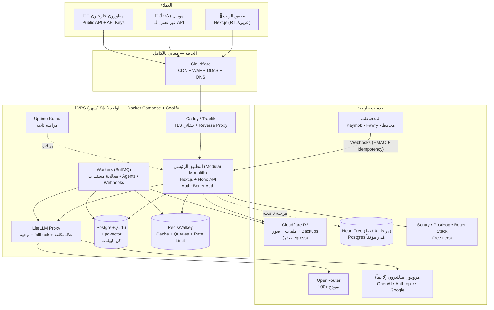
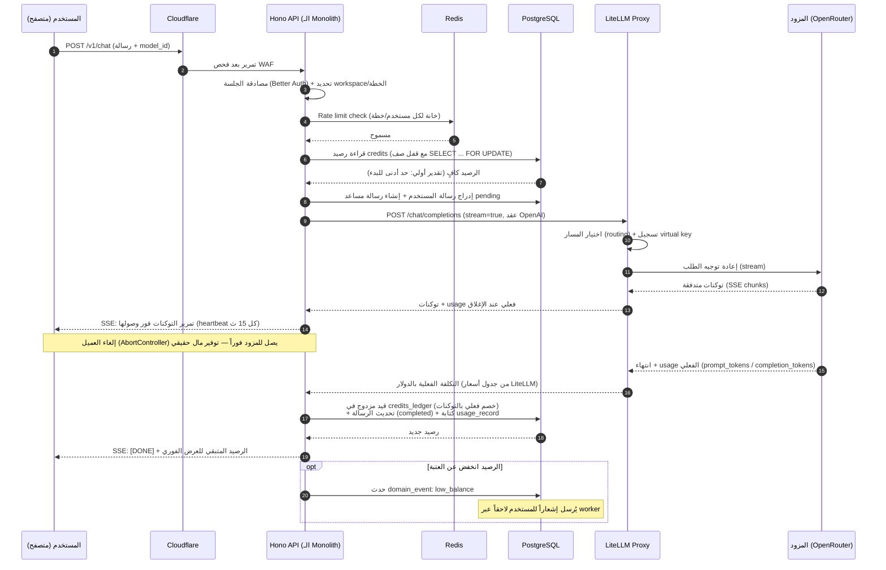
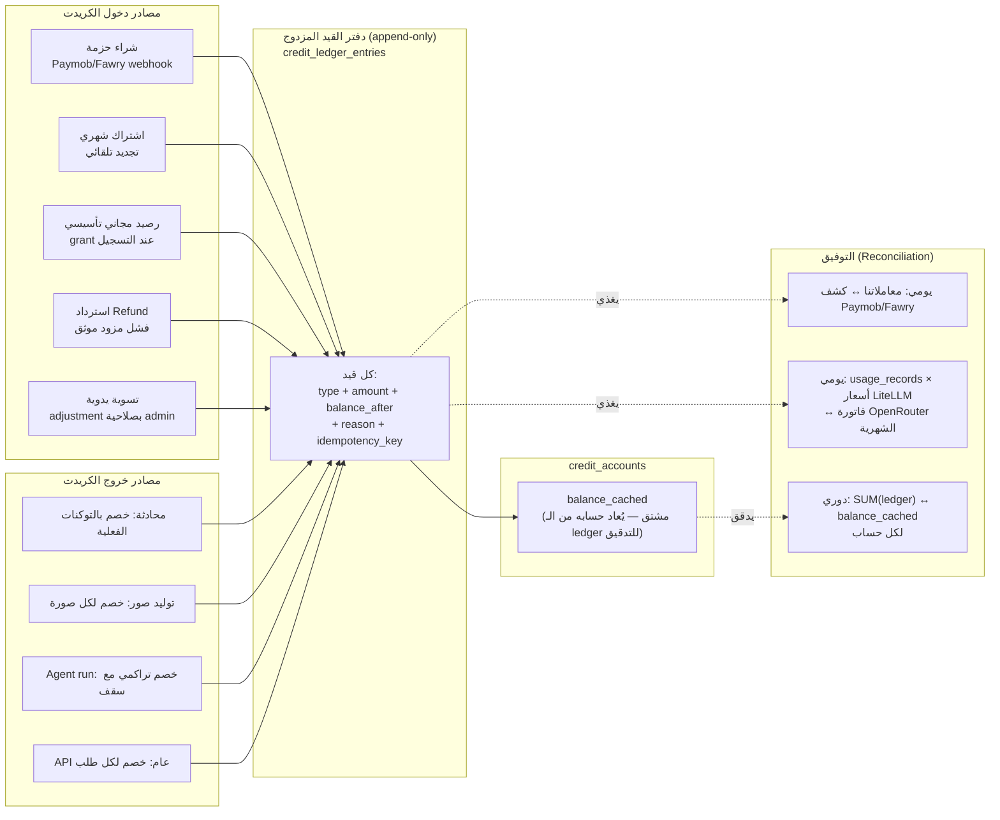
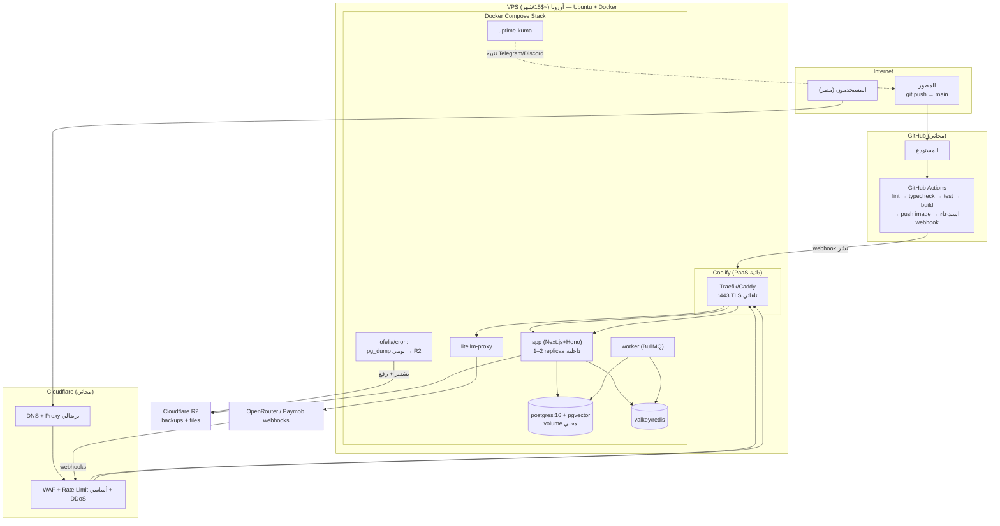

# 04 — التصميم المعماري الكامل (Technical Architecture)

> **نوع المستند:** Design Doc بأسلوب Google (Context → Goals → Non-Goals → Design → Alternatives → Cross-cutting Concerns → Rollout).
> **الحالة:** مقترح للاعتماد (Proposed).
> **الجمهور:** المؤسس، المهندسون، أي شريك تقني مستقبلي.
> **المستندات المرتبطة:** `01-market-research.md`، `02-business-model.md`، `03-product-spec.md` (أجزاء نفس المشروع).
> **آخر تحديث:** يوليو 2026.

---

## 0. ملخص تنفيذي (TL;DR)

نبني منصة AI عربية شاملة (محادثة متعددة النماذج، توليد كود وصور، تحليل مستندات، MCP Servers، مكتبة Prompts، Workspaces، ذاكرة، AI Agents، فرق، API عام، ونظام Credits بالجنيه المصري) فوق قيد مالي صارم: **VPS واحد بحدود ~$15/شهر + دومين فقط في البداية**، وكل شيء آخر عبر Free Tiers أو استضافة ذاتية.

القرارات الجوهرية في سطور:

1. **Modular Monolith** واحد (Next.js + Node API) وليس Microservices — لأن فاتورة التعقيد عند صفر مستخدم أغلى من أي فاتورة سيرفر.
2. **LiteLLM Proxy ذاتي الاستضافة** كطبقة تجريد إلزامية فوق OpenRouter وأي مزود مستقبلي — هذا أهم قرار معماري في المشروع كله لأنه يمنع Vendor Lock-in ويحمي هامش الربح 25–40%.
3. **PostgreSQL واحد يحمل كل شيء** (بيانات علائقية + pgvector للـ embeddings + طوابير خفيفة عبر `pg-boss` إن لزم) قبل إضافة أي مخزن متخصص.
4. **نظام Credits بدفتر قيد مزدوج (Double-Entry Ledger)** لا رصيداً متحركاً بلا أثر — قلب المنصة المحاسبي.
5. **Cloudflare R2 للملفات** لأن صفر Egress Fees يعني أن نجاحنا لا يعاقبنا مالياً.
6. **خارطة تدرج صادقة من 4 مراحل**: VPS واحد → DB مُدار منفصل → Multi-node + Workers → وKubernetes؟ غالباً لا نحتاجه أبداً، وسنشرح لماذا بصدق.

---

## 1. فلسفة التصميم: "Scale-Zero, Cost-First"

### 1.1 السؤال الحاكم لكل قرار

> **"كم يكلّف هذا شهرياً عند صفر مستخدم؟"**

كل قرار معماري في هذا المستند — من اختيار قاعدة البيانات إلى طريقة النشر — يجب أن يجيب على هذا السؤال برقم. القاعدة:

| الإجابة | الحكم |
|---|---|
| $0/شهر (free tier حقيقي أو self-hosted) | ✅ مقبول افتراضياً |
| $0 لكن بحدود free tier تُستهلك بسرعة | ⚠️ مقبول مع خطة خروج موثقة |
| > $0 ثابت حتى بلا مستخدمين | ❌ مرفوض في المرحلة 0 إلا بمبرر وجودي (الدومين، الـ VPS) |
| تكلفة متغيرة تنمو مع الاستخدام (usage-based) | ✅ مرغوبة — لأنها تعني أننا ندفع فقط حين نربح |

هذا يقلب المنطق التقليدي: المهندسون يخافون من التكلفة المتغيرة ويحبون الثابتة. نحن العكس — **نحب المتغيرة لأنها مقترنة بالإيراد**، ونخاف من الثابتة لأنها نزيف صامت أثناء بناء المنتج.

### 1.2 لماذا Modular Monolith وليس Microservices؟

الإغراء مفهوم: "منصة فيها محادثة + صور + مستندات + Agents + MCP + فوترة + API عام… هذا بالتأكيد يحتاج خدمات موزعة!" — **لا، ليس بعد.** لنتحدث بصراحة:

**الحجة ضد Microservices المبكرة:**

1. **الرياضيات المالية قاسية:** كل خدمة منفصلة تحتاج (كحد أدنى) عملية تعمل باستمرار + مراقبة + logging + نشر مستقل. على VPS بـ 2–4GB RAM، خمس خدمات تعني أن نصف الذاكرة تذهب لنفقات تشغيلية (overhead) لا لخدمة المستخدمين.
2. **التعقيد التشغيلي يضرب فريقاً من شخص واحد/اثنين:** Distributed tracing، إدارة العقود بين الخدمات، فشل الشبكة الجزئي، ترحيل قواعد بيانات متعددة — كلها ضرائب ندفعها قبل أن يكون عندنا أول عميل يدفع.
3. **أقوى الحجج ضد Microservices (العزل، استقلال الفرق، التوسع المنفصل) لا تنطبق علينا اليوم:** لا فرق متعددة، لا حمل يستوجب توسعاً منفصلاً، وقاعدة بيانات واحدة مشتركة أصلاً (أي أن "الاستقلال" وهمي).
4. **الانتقال من Monolith نظيف إلى خدمات لاحقاً أسهل بكثير** من الانتقال من Microservices مبكرة فوضوية إلى أي شيء آخر.

**ما هو الـ Modular Monolith الذي نقصده تحديداً؟**

```
┌─────────────────────────────────────────────────────────────┐
│                    التطبيق الواحد (Process واحد)              │
│  ┌───────────┐ ┌───────────┐ ┌───────────┐ ┌─────────────┐  │
│  │  Module:   │ │  Module:  │ │  Module:  │ │  Module:    │  │
│  │  Chat      │ │  Billing/ │ │  RAG &    │ │  Agents &   │  │
│  │  & Models  │ │  Credits  │ │  Memory   │ │  MCP        │  │
│  └───────────┘ └───────────┘ └───────────┘ └─────────────┘  │
│  ┌───────────┐ ┌───────────┐ ┌───────────┐ ┌─────────────┐  │
│  │  Module:  │ │  Module:  │ │  Module:  │ │  Module:    │  │
│  │  Auth &   │ │  Public   │ │  Prompts  │ │  Files &    │  │
│  │  Teams    │ │  API      │ │  Library  │ │  Images     │  │
│  └───────────┘ └───────────┘ └───────────┘ └─────────────┘  │
│         حدود صارمة بين الوحدات: لا استيراد متبادل عشوائي،    │
│         كل وحدة لها schema واضح في Postgres وواجهة داخلية     │
└─────────────────────────────────────────────────────────────┘
```

القواعد الملزمة داخل الـ Monolith (هي التي تجعله "Modular" فعلاً لا مجرد كرة طين):

- **حدود وحدات صارمة (Module Boundaries):** كل وحدة تعيش في مجلدها، تُصدّر واجهة (interface) فقط، ويُمنع الاستيراد العميق من داخل وحدة أخرى (نفرضه بـ ESLint boundaries أو dependency-cruiser).
- **ملكية البيانات:** كل جدول في Postgres "تملكه" وحدة واحدة؛ الوحدات الأخرى تقرأ عبر واجهة الوحدة المالكة، لا عبر JOIN مباشر متسلل.
- **لا distributed transactions:** أي عملية متعددة الخطوات عبر وحدات تمر عبر Outbox/Events داخلية (جدول `domain_events`) — وهذا بالضبط ما سيسهّل فصل الوحدات لاحقاً.
- **نقاط القطع المحددة مسبقاً (Pre-defined Seams):** نعرف من اليوم ما الذي سيُفصل أولاً عند الحاجة: (1) Workers معالجة المستندات، (2) بوابة الـ streaming للنماذج، (3) الـ Public API.

**متى نتدرّج نحو خدمات منفصلة؟ (محفزات موضوعية لا مشاعر):**

| المحفز (Trigger) | القرار |
|---|---|
| معالجة المستندات تستهلك CPU/ذاكرة تُسقط الـ API | فصل Worker منفصل على نفس الـ VPS أو VPS ثانٍ (مرحلة 2) |
| > ~5K مستخدم نشط وذروة streaming تخنق الـ event loop | فصل Chat Gateway كخدمة Node مستقلة |
| فريق هندسي > 4 أشخاص يتداخلون في نفس الكود يومياً | إعادة تقييم الحدود — ربما فصل حقيقي |
| حاجة لتوسع مستقل (مثلاً 10 workers للـ embeddings ولا نحتاج توسيع الـ API) | فصل تلك الوحدة فقط |

> **القاعدة الذهبية:** نفصل وحدة عندما يكون لدينا *دليل قياس* (metrics) على أن فصلها يحل مشكلة حقيقية، وليس لأن "الكبر يستوجب microservices".

### 1.3 مبادئ إضافية

- **Boring Technology أولاً:** PostgreSQL وRedis وDocker وNode — تقنيات مملة، موثقة، وتوظيف من يعرفها سهل في مصر. ندخر "رصيد الابتكار" للمنتج نفسه لا للبنية التحتية.
- **Buy the bottleneck, self-host the commodity:** ندفع فقط فيما يقتلنا لو أدرناه بأنفسنا (جودة النماذج = نشتريها من OpenRouter)، ونستضيف ذاتياً ما هو سلعي (Redis, Postgres, LiteLLM, Uptime Kuma).
- **لا بناء لما يُشترى بـ $0:** نظام auth جاهز (Better Auth) أفضل من auth نكتبه — الوقت هو أغلى مواردنا.
- **كل شيء قابل للاستبدال عبر طبقة تجريد:** النماذج خلف LiteLLM، التخزين خلف واجهة S3-متوافقة، الـ cache خلف واجهة Redis-متوافقة.

---

## 2. المكدس التقني (The Stack) — القرارات والبدائل بصدق

لكل اختيار: **القرار → المبررات → البدائل التي درسناها بأمانة → متى نغيّر رأينا.**

### 2.1 الواجهة الأمامية (Frontend)

**✅ القرار: Next.js (App Router) + TypeScript + Tailwind CSS + shadcn/ui، مع دعم RTL والعربية كمواطن درجة أولى.**

**لماذا:**

1. **Full-stack في مستودع واحد:** الـ Monolith يبدأ كـ Next.js app واحد: الصفحات + API routes (أو proxy إلى Hono — انظر 2.2). فريق صغير = أقل context switching.
2. **النظام البيئي:** shadcn/ui يعطي مكونات accessible قابلة للتملّك (الكود يُنسخ لمشروعك، لا تبعية سوداء الصندوق) — مثالي لتخصيص عربي عميق.
3. **التوظيف في مصر:** أغلب مطوري الواجهات في السوق المصري يعرفون React/Next.
4. **العربية/RTL:** Tailwind يدعم المنطق الاتجاهي (`ms-`, `me-`, `ps-`, `pe-`, `rtl:` variants) ومع `<html dir="rtl" lang="ar">` + خط عربي مناسب (مثل IBM Plex Sans Arabic أو Cairo) نحصل على تجربة RTL نظيفة. المحادثة نفسها تحتاج **اتجاهاً مختلطاً ذكياً**: فقاعة الرسالة تضبط `dir="auto"` لأن الرد قد يكون إنجليزياً أو كوداً.
5. **Streaming من الدرجة الأولى:** React Server Components + fetch streaming + `useChat`-نمط hooks يجعل عرض التوكنات المتدفقة سلساً.

**البدائل بصدق:**

| البديل | مزاياه الحقيقية | لماذا رفضناه (الآن) |
|---|---|---|
| **SvelteKit** | أخف، أسرع، JS أقل للمتصفح، تجربة تطوير ممتعة | نظام بيئي أصغر، مكونات RTL جاهزة أقل، توظيف أصعب في مصر، ومكتبات AI/streaming الجاهزة (AI SDK) تركز على React أولاً |
| **Remix / React Router v7** | نمط بيانات أنظف (loaders/actions)، أقرب للويب الأساسي | اندمج عملياً مع React Router v7 والمستقبل غامض قليلاً مقابل زخم Next.js، ومكتبة shadcn/ui والـ AI SDK افتراضها Next |
| **Nuxt (Vue)** | ممتاز وبسيط | نفس مشكلة النظام البيئي والتوظيف محلياً |
| **Astro + جزيرة React** | مثالي للصفحات التسويقية | منصتنا تطبيق تفاعلي كثيف (محادثة)، Astro يضيف تعقيداً بلا فائدة هنا — قد نستخدمه للمدونة/SEO لاحقاً |

**متى نغيّر؟** لا نغيّر الواجهة غالباً أبداً. التغيير الواقعي الوحيد: فصل موقع تسويقي (Astro/صفحات ثابتة) عن التطبيق عندما تشتد حاجة SEO.

### 2.2 الواجهة الخلفية (Backend / API)

**✅ القرار: Node.js + TypeScript مع Hono (الافتراضي) — وNestJS كبديل شرعي إذا كبر الفريق.**

**لماذا Hono تحديداً:**

1. **خفيف وسريع جداً** (أقرب لـ Express بلا شحوم، وأداؤه من الأفضل في Node)، ويعمل على أي runtime (Node/Bun/Edge) — مرونة نشر مستقبلية مجانية.
2. **TypeScript من الطرف للطرف:** مع Drizzle وZod نحصل على أنواع مشتركة بين الـ API والواجهة (ونوافذ RPC خفيفة عبر Hono RPC إن أردنا).
3. **مثالي للـ SSE/Streaming:** middleware بسيط، تحكم كامل في الـ Response stream — وهو قلب تجربة المحادثة.
4. **سطح صغير = سطح هجوم صغير = عقل صغير مطلوب لصيانته.**

**وماذا عن NestJS؟** إطار ممتاز يفرض معمارية Modular (Modules/Providers/Guards) — وهي *نفس* فلسفتنا. عيبه عندنا: أثقل (decorators + DI + reflect-metadata)، منحنى تعلم أعلى، وسرعة تطوير أبطأ لشخص/شخصين. **الحكم:** Hono مع انضباط مجلدات صارم الآن؛ إذا أصبح الفريق 4+ وبدأت الفوضى، الهجرة إلى NestJS قرار مبرر.

**البدائل بصدق:**

| البديل | مزاياه الحقيقية | لماذا رفضناه (الآن) |
|---|---|---|
| **Go (chi/Gin)** | أداء وذاكرة متفوقة، concurrency بديهية، ثنائي واحد للنشر | كتابة منطق فوترة/JSON معقد أبطأ، النظام البيئي لـ AI SDKs بالعربية/JS أغنى، والتوظيف في مصر لـ Go أصعب وأغلى. الفارق في الأداء ليس عنق الزجاجة — عنق الزجاجة هو انتظار المزود |
| **Python + FastAPI** | الأقرب لعالم AI (LangChain/LlamaIndex)، مكتبات embeddings محلية | لغتان في المشروع (TS للواجة + Python للخلفية) = ضعف عبء التوظيف والأدوات، أداء async أضعف من Node للـ I/O الكثيف (محادثات متزامنة كثيرة)، ونحن *وسطاء* للنماذج لا مشغّلوها — لا نحتاج مكتبات Python للاستدلال |
| **Bun بدل Node** | أسرع، مدير حزم مدمج | نضج أقل في حواف الإنتاج (بعض حزم native)؛ خيار تسريع لاحقاً بلا تغيير كود تقريباً مع Hono |
| **tRPC بدل REST** | أنواع من الطرف للطرف بلا توليد | الـ Public API الخارجي يحتاج REST/OpenAPI معلن وموثق — سنستخدم OpenAPI على أي حال، فنحصل على الفائدة للداخل والخارج |

**متى نغيّر؟** لو ظهرت حاجة حقيقية لتشغيل نماذج محلية (embeddings محلية ثقيلة، whisper محلي) نضيف **خدمة Python صغيرة معزولة** لتلك المهمة فقط — وهذا هجين محسوب لا تخلف عن القرار.

### 2.3 قاعدة البيانات (Database)

**✅ القرار: PostgreSQL — تبدأ على Neon Free أو Supabase Free، ثم تنتقل إلى Self-hosted على الـ VPS عند الحاجة — مع Drizzle ORM.**

**لماذا Postgres بالذات:** لأنها "قاعدة البيانات الواحدة التي تفعل كل شيء" — علائقية + JSONB + Full-text search + **pgvector** للـ embeddings + طوابير (`pg-boss`/SKIP LOCKED) + Partitioning للجداول الضخمة (الـ ledger والرسائل). كل خدمة متخصصة نؤجلها هي فاتورة $0 نكسبها.

**خطة الاستضافة (هذا هو الجزء المالي الذكي):**

| المرحلة | الاستضافة | التكلفة | الملاحظات |
|---|---|---|---|
| 0 (0–1K مستخدم) | Neon Free (0.5GB تخزين، compute يتنفس scale-to-zero) أو Supabase Free (500MB) | $0 | لا نبدأ self-hosted لأن قاعدة بيانات مُدارة بـ backups تلقائية أرخص من وقتنا |
| أواخر 0 | Postgres داخل Docker على نفس الـ VPS + backups يومية إلى R2 | $0 إضافي (ضمن الـ $15) | ننتقل حين نقترب من حدود الـ free tier أو نحتاج امتدادات/تحكم |
| 1 (1K–10K) | Neon Scale (~$19) أو VPS أقوى | ~$0–19 | قرار يُتخذ بالأرقام حينها |
| 2 (10K–100K) | Postgres مُدار أكبر أو عقدة مخصصة + Read replica عند اللزوم | ضمن ميزانية $150–400 | — |

> **لماذا Neon تحديداً كبداية؟** Scale-to-zero يعني حرفياً $0 عند عدم الاستخدام، branching لقواعد البيانات (ممتاز للتطوير والـ preview)، وسيرفرات EU (فرانكفورت) — أقرب لمصر من أمريكا (زمن استجابة أقل بعشرات المللي ثانية، وسنعود لهذه النقطة في §14).

**لماذا Drizzle ORM:**

- SQL-أولاً (schema يُكتب بـ TypeScript لكنه يُترجم لـ SQL نظيف تفهمه)، migrations مولّدة وخفيفة، بلا سحر runtime ثقيل (عكس Prisma الذي يحمل query engine خاصاً وذاكرة أعلى).
- يعيش سعيداً مع `postgres.js` ومع Neon serverless driver.

**البدائل بصدق:**

| البديل | مزاياه | لماذا رفضناه |
|---|---|---|
| **Prisma** | DX ممتازة، نضج | حجم الذاكرة أعلى، cold start أبطأ، SQL المولّد أحياناً دون المستوى، والتحكم في الاستعلامات الدقيقة (المحاسبة!) أصعب |
| **MySQL/MariaDB** | مستقرة ومنتشرة | لا pgvector، JSONB أضعف، لا ميزة حاسمة لنا |
| **MongoDB** | مرونة المستندات | نحتاج معاملات محاسبية صارمة وعلاقات معقدة؛ JSONB في Postgres يعطينا مرونة المستندات *داخل* عالم علائقي |
| **SQLite (Turso)** | $0 وبساطة مدهشة | قفل كاتب واحد سيخنق الـ ledger والمحادثات المتزامنة؛ خيار لأداة جانبية لا للمنصة |

**متى نغيّر؟** لا نغيّر Postgres أبداً غالباً؛ نغيّر *مكان استضافتها* فقط وفق الجدول أعلاه.

### 2.4 التخزين المؤقت والطوابير (Cache & Queue)

**✅ القرار: Upstash Redis Free أولاً ← Redis ذاتي الاستضافة على الـ VPS + BullMQ عند النمو.**

**لماذا:**

- **Upstash Free:** 10K طلب/يوم مجاناً — يكفي تماماً لمرحلة 0 (rate limiting، جلسات، cache لميتادات النماذج، قفل idempotency للـ webhooks). Serverless pricing = $0 عند الصفر.
- **متى ننتقل للـ Redis الذاتي؟** عندما نبدأ BullMQ بجد (طوابير Agents ومعالجة المستندات) — الطوابير تستهلك أوامر كثيرة ستتجاوز 10K/يوم سريعاً. Redis في Docker يستهلك ~30–50MB RAM فقط.
- **BullMQ:** الطابور المعياري لعالم Node: retries، delayed jobs، rate-limited workers، ولوحة مراقبة (bull-board) ذاتية الاستضافة.

**البدائل:** Valkey (بديل Redis المفتوح بالكامل — مرشح للاستضافة الذاتية)، NATS (أقوى لكن overkill)، RabbitMQ (أثقل تشغيلياً بلا داعٍ)، pg-boss (طابور داخل Postgres — **احتياطي ذكي إذا أردنا تأجيل Redis كلياً**)، SQS (تكلفة + إقليم بعيد).

### 2.5 بوابة النماذج: LiteLLM Proxy — أهم قرار معماري في المشروع

**✅ القرار: LiteLLM Proxy ذاتي الاستضافة (حاوية Docker على الـ VPS) كطبقة التجريد الإلزامية الوحيدة بين تطبيقنا وبين OpenRouter وأي مزود آخر.**

**لماذا هذا أهم قرار (وليس مجرد تفصيل تقني):**

1. **يمنع Vendor Lock-in بالكامل:** كودنا يتحدث OpenAI-compatible API فقط. تبديل/إضافة مزود (OpenRouter اليوم، OpenAI/Anthropic/Google مباشرة غداً بأسعار أرخص بالجملة، أو نموذج مفتوح ذاتي الاستضافة بعد غدٍ) = **تعديل ملف YAML، لا تعديل كود**.
2. **يحمي هامش الربح (25–40%):** LiteLLM يعرف تكلفة كل نموذج بالتوكن (قاعدة أسعار مدمجة + override خاص بنا بأسعار OpenRouter الفعلية)، فيرجع تكلفة كل طلب بدقة — وهذا وقود نظام الـ Credits (§6). بدونه سنبني عدّاد تكلفة بأنفسنا ونطارد تحديثات أسعار 100+ نموذج يدوياً.
3. **Routing وFallbacks جاهزة:** نموذج معطّل/بطيء على OpenRouter؟ تحويل تلقائي لبديل. نموذج أرخص بنفس الجودة للطلبات "الخفيفة"؟ router يوجه حسب الخطة/السياق.
4. **مفاتيح افتراضية وحدود إنفاق داخلية:** يمكن إصدار virtual keys لكل بيئة/خدمة داخلية مع budget — خط دفاع ثانٍ ضد التسريبات والـ runaway costs.
5. **Cache دلالي (semantic cache) اختياري** للطلبات المتكررة — توفير مباشر.

**المعمارية حوله:**

```
تطبيقنا (Hono API)
      │  OpenAI-compatible /chat/completions (stream)
      ▼
LiteLLM Proxy (Docker على VPS) ── قاعدة أسعار + routing + fallback + spend logs
      │
      ├─► OpenRouter (المزود الافتراضي — 100+ نموذج بمفتاح واحد)
      ├─► OpenAI مباشرة (لاحقاً، لنماذج مختارة بهامش أفضل)
      ├─► Anthropic / Google مباشرة (لاحقاً)
      └─► نموذج مفتوح self-hosted (بعيداً، لمهام داخلية رخيصة كالتلخيص)
```

**البدائل بصدق:**

| البديل | مزاياه | لماذا رفضناه |
|---|---|---|
| **نداء OpenRouter مباشرة من الكود** | أبسط بخطوة واحدة | نورث اقتراناً مباشراً بمزود واحد، ونبني عدّاد التكلفة والـ fallback بأنفسنا — وفاتورة "البساطة" تُدفع عند أول تغيير مزود |
| **Portkey / Helicone (مُدارة)** | ميزات observability أغنى | تكلفة شهرية عند النمو + بيانات مستخدمينا تمر بطرف ثالث — حساسية خصوصية في سوقنا |
| **بناء طبقتنا الخاصة** | تحكم مطلق | إعادة اختراع عجلة يصونها مجتمع كامل؛ وقتنا أغلى |
| **AI SDK (Vercel) وحده كتجريد** | ممتاز للواجهة والأنواع | تجريد *كود* فقط، لا عدّاد تكلفة مركزي ولا virtual keys ولا cache على مستوى البوابة — **نستخدمه داخل التطبيق *فوق* LiteLLM، لا بديلاً عنه** |

**متى نغيّر؟** إذا تعثر LiteLLM تشغيلياً عند حمل ضخم (مرحلة 3+)، خياراتنا مفتوحة لأن العقد هو OpenAI-compatible: بوابة خاصة بنا أو بديل آخر — التبديل ممكن لأن القرار *الاستراتيجي* (طبقة التجريد) ثابت، والأداة قابلة للاستبدال.

### 2.6 البحث المتجهي (Vector Search)

**✅ القرار: pgvector داخل Postgres نفسها — لا قاعدة vector متخصصة في البداية.**

**لماذا ليس Qdrant/Pinecone الآن:**

- **Pinecone:** لا free tier حقيقي دائم للإنتاج (serverless له حدود، والتكلفة تبدأ فور النمو) + بيانات مستندات عملائنا تسافر لطرف ثالث.
- **Qdrant/Weaviate/Milvus ذاتية الاستضافة:** خدمة إضافية = RAM إضافية (Qdrant مريح بـ ~500MB+ فعلياً تحت حمل) + نسخ احتياطية منفصلة + كائن تشغيلي جديد — كل ذلك لخدمة بضع مئات آلاف vector؟
- **pgvector عند أحجامنا (حتى ~1–2 مليون vector بأبعاد 1536 مع IVFFlat/HNSW):** أداء أكثر من كافٍ (Recall ممتاز مع HNSW منذ 0.5+)، والأهم: **استعلام واحد يجمع الفلترة العلائقية والبحث المتجهي** (`WHERE workspace_id = $1 ORDER BY embedding <=> $2 LIMIT 8`) — بلا شبكة، بلا مزامنة بين قاعدتين، بلا فاتورة.

**متى نغيّر فعلاً؟** عند تجاوز ~3–5 ملايين vector مع QPS بحث مرتفع يضغط Postgres، أو حاجة لميزات متخصصة (hybrid ranking معقد، multi-tenancy vector ضخم). حينها Qdrant self-hosted هو الخيار — والانتقال نظيف لأن الـ embeddings تُخزن مرجعياً ويمكن إعادة فهرستها.

### 2.7 تخزين الملفات (Object Storage)

**✅ القرار: Cloudflare R2 — ونشرح لماذا "صفر egress fees" قرار مصيري وليس رفاهية.**

**المشكلة الاقتصادية:** منصتنا ستُخزّن *وتُعيد تنزيل* مستندات وصوراً مولّدة باستمرار. في AWS S3، التخزين رخيص (~$0.023/GB) لكن **الإخراج (egress) هو القاتل**: ~$0.09/GB. سيناريو واقعي: 5K مستخدم يولّدون وينزّلون 200GB شهرياً → فاتورة egress وحدها ~$18 تتضخم مع كل نجاح. نموذج عملنا بهامش 25–40% لا يتحمل ضريبة نمو كهذه.

**لماذا R2 تحديداً:**

- **$0 egress — بالحرف.** نزّل ما شئت، الفاتورة لا تتغير.
- **10GB تخزين + 10M عملية قراءة مجاناً شهرياً** (free tier دائم) — مرحلة 0 كاملة بـ $0.
- **S3-compatible API** — كودنا يتحدث لـ R2 اليوم ولأي S3/MinIO غداً بلا تغيير (نفس فلسفة LiteLLM: طبقة تجريد بعقد معياري).
- **اندماج طبيعي مع Cloudflare CDN المجاني** أمام الدومين.

**البدائل:** Backblaze B2 (رخيص لكن egress مدفوع فوق حد، والشراكة مع Cloudflare حسّنته لكن R2 أبسط)، AWS S3 (egress قاتل كما شرحنا)، MinIO ذاتي الاستضافة على الـ VPS ($0 لكن يأكل قرص الـ VPS الصغير ويحولنا لمديري تخزين — **ملاذ أخير** إذا تعذر R2)، Supabase Storage (حدود free tier صغيرة 1GB).

### 2.8 المصادقة (Auth)

**✅ القرار: Better Auth (مكتبة self-hosted داخل تطبيقنا، مجانية بالكامل).**

**تحليل التكلفة بصراحة (لأن هذا قرار مالي بامتياز):**

| الخيار | التكلفة عند 1K مستخدم نشط | عند 25K MAU | الملاحظات |
|---|---|---|---|
| **Better Auth (اختيارنا)** | $0 | $0 | بيانات المستخدمين في Postgres الخاصة بنا — لا طرف ثالث، لا سقف MAU، دعم sessions/social/2FA/organizations (يناسب ميزة "الفرق" لدينا) |
| **Clerk** | $0 حتى 10K MAU | ~$25+/شهر ويتصاعد بسرعة مع المقاعد والميزات | DX رائعة لكنها ضريبة نمو — وأسعارها تتغير صعوداً تاريخياً |
| **Supabase Auth** | $0 ضمن free tier | مربوط ببقاءنا داخل Supabase | يقيدنا بمزود واحد؛ إن خرجنا من Supabase نفقد الـ auth |
| **Auth.js (NextAuth)** | $0 | $0 | مرن لكن Better Auth أحدث وأكمل للحالات المؤسسية (org/roles/2FA) بنفس السعر: صفر |

**الحكم:** Better Auth يعطينا ميزات مدفوعة عند المنافسين (Organizations للفرق، RBAC، 2FA) بـ $0 ومع سيادة كاملة على البيانات — متوافق مع القانون المصري لحماية البيانات (§9.7). المقابل: نحن مسؤولون عن تأمينه — وهذا مُحاسب في §9.

### 2.9 المدفوعات (Payments — مصر أولاً)

**✅ القرار: Paymob أساساً + Fawry كقناة ثانية + محافظ إلكترونية (Vodafone Cash وغيرها عبر نفس البوابات) — تكامل API مع Webhooks وIdempotency صارم.**

**لماذا هذا التشكيل للسوق المصري:**

- **Paymob:** البوابة الأوسع انتشاراً محلياً: بطاقات بنكية (Visa/Mastercard/Meeza)، محافظ (فودافون كاش، أورانج، اتصالات، WE Pay)، أقساط، وواجهات API/webhooks ناضجة. رسوم ~2.5–3.5% للبطاقات وفئات مشابهة للمحافظ (تُبنى في التسعير — انظر مستند نموذج العمل).
- **Fawry:** قناة دفع نقدي/فروع ضخمة (شبكة نقاط بيع في كل مصر) + FawryPay للأونلاين — حاسمة لشريحة غير حاملي البطاقات، وهي شريحة كبيرة في مصر.
- **Stripe/Paddle؟** لا يدعمان مصر كدولة نشاط تجاري مباشرة بسهولة، والتحصيل الدولي لاحقاً (للمغتربين/التوسع الخليجي) قد يستدعي Stripe كقناة *إضافية* لا بديلة.

**المبادئ التقنية الملزمة (تفصيل أعمق في §7):**

1. **Idempotency Keys إلزامية:** كل عملية شحن credits تُربط بمفتاح فريد (معرف العملية من البوابة) — إعادة إرسال الـ webhook مئة مرة = شحن واحد.
2. **Webhooks هي مصدر الحقيقة الوحيد:** لا نثق بـ redirect نجاح من المتصفح أبداً؛ الـ webhook الموقَّع (HMAC) هو الذي يحرك الـ ledger.
3. **التوفيق اليومي (Reconciliation):** وظيفة cron تقارن سجلاتنا مع كشف البوابة.

### 2.10 بث التوكنات (Streaming)

**✅ القرار: Server-Sent Events (SSE) كقناة افتراضية، مع WebSocket كخيار ثانٍ محسوب.**

**التصميم بالتفصيل (المخطط الكامل في §4.ب):**

- **لماذa SSE أولاً:** نصف اتجاهي هو كل ما نحتاجه (الخادم → العميل)، يعمل فوق HTTP/1.1 العادي عبر أي proxy (Caddy/Cloudflare بلا إعداد خاص)، إعادة الاتصال التلقائي مدمجة في المتصفح (`EventSource`)، والتعافي من انقطاع أسهل.
- **متى WebSocket؟** ميزات مستقبلية ثنائية الاتجاه حقيقية (تحرير تعاوني، "الكتابة معاً"، voice). نؤجله حتى تطلبه ميزة فعلية — لا نبنيه احترازياً.
- **التفاصيل التشغيلية الحرجة:**
  - **Heartbeat كل ~15 ثانية** (`: ping\n\n`) لمنع proxies/Cloudflare من قتل الاتصال الخامل.
  - **تعطيل buffering على الـ reverse proxy** (`X-Accel-Buffering: no` / إعداد مكافئ في Caddy) وإلا وصلت التوكنات دفعة واحدة بعد انتهاء الرد.
  - **إلغاء حقيقي (AbortController) من العميل حتى المزود:** إغلاق التبويب = إيقاف طلب OpenRouter فوراً = توفير مال فعلي + تحرير موارد.
  - **التسوية عند الانقطاع:** إذا انقطع الـ stream من المزود في المنتصف، نحفظ ما وصل مع `finish_reason: "incomplete"` ونخصم credits عن التوكنات المستهلكة فعلاً فقط (المحاسبة الدقيقة في §6).

### 2.11 النشر والاستضافة (Deployment)

**✅ القرار: Docker Compose على VPS واحد (أوروبا)، تديره Coolify (أو Dokploy) كـ PaaS ذاتية مجانية، مع Caddy/Traefik كـ reverse proxy + شهادات TLS تلقائية، وCloudflare CDN المجاني أمام كل شيء.**

**التشكيل:**

- **الـ VPS (~$15/شهر):** مزود بسيرفرات أوروبية جيدة السمعة (Hetzner فئة CX22/CX32 أو Contabo أو ما يماثلها — 2–4 vCPU، 4–8GB RAM). أوروبا وليس أمريكا لزمن الاستجابة من مصر (§14).
- **Coolify أو Dokploy:** كلاهما بديل ذاتي الاستضافة مجاني لـ Heroku/Vercel: نشر من Git push، preview، إدارة شهادات، قوالب Docker جاهزة. الفرق بينهما تفضيلي (Coolify أنضج قليلاً ومجتمعه أكبر؛ Dokploy أحدث وأخف) — أيّهما يُختار، العقد هو Docker Compose فلا حبس.
- **Caddy (أو Traefik المدمج مع Coolify):** TLS تلقائي عبر Let's Encrypt، HTTP/2+3، إعداد بسيط.
- **Cloudflare المجاني:** CDN + WAF أساسي + حماية DDoS + DNS — قيمة هائلة بـ $0، وهو أيضاً سبب اختيار R2 (عائلة واحدة).

**لماذا ليس Vercel/Render/Railway؟** free tiers هناك مصممة لتذكيرك بأنك لا تدفع: نوم (sleep)، حدود bandwidth، وظائف serverless بمهلات تقتل الـ streaming الطويل، وأسعار ما بعد المجاني تصعد بسرعة تفوق VPS. قاعدتنا: **الـ $15 الثابتة الوحيدة تشتري لنا حرية كاملة بلا مفاجآت.**

### 2.12 CI/CD

**✅ القرار: GitHub Actions.**

- مجاني بالكامل للمستودعات العامة، وللخاصة: ~2000 دقيقة/شهر — تكفي فريقاً صغيراً بسهولة (pipeline لدينا: lint + typecheck + test + build + نشر عبر SSH/Webhook إلى Coolify ≈ 5–8 دقائق للتشغيلة).
- النشر: push إلى `main` → build Docker image → Coolify webhook يسحب ويعيد النشر بلا توقف ملحوظ (rolling/recreate حسب الخدمة).
- **البدائل:** GitLab CI (ممتاز لكننا على GitHub أصلاً)، Woodpecker/Act ذاتية (overkill الآن). لا داعي لأكثر من ذلك.

### 2.13 المراقبة والتحليلات (Observability)

**✅ القرار (كله $0 ضمن free tiers أو self-hosted):**

| الوظيفة | الأداة | التكلفة |
|---|---|---|
| Uptime + تنبيهات فورية | **Uptime Kuma** (self-hosted على نفس الـ VPS) | $0 |
| إدارة الـ Logs وتنبيهات الأخطاء التشغيلية | **Better Stack** free tier | $0 |
| تتبع الأخطاء (Exceptions) | **Sentry** free (5K أحداث/شهر) | $0 |
| تحليلات المنتج (funnels، retention، feature flags) | **PostHog** free (1M حدث/شهر) — أو self-hosted لاحقاً | $0 |
| مقاييس داخلية اختيارية | Prometheus + Grafana ذاتياً عند الحاجة فعلاً | $0 |

مبدأ: **كل خدمة مراقبة مُدارة مجانية هي دين سنرده لاحقاً بترحيل، فنختار ما ترحيله رخيص** (Sentry وPostHog لهما بدائل self-hosted جاهزة عند تجاوز الحدود).

---

## 3. المخططات المعمارية (Mermaid)

### 3.أ المعمارية عالية المستوى



### 3.ب تدفق طلب محادثة (من المستخدم إلى المزود والعودة Streaming)

هذا أهم تدفق في المنصة — يمر بـ 12 خطوة، وكل خطوة لها سبب محاسبي أو أمني:



**قواعد حاكمة لهذا التدفق:**

- **الخصم دائماً على الاستهلاك الفعلي** (usage الذي يرجعه المزود)، لا على تقدير مسبق. التقدير المسبق يُستخدم فقط كـ "حد أدنى للسماح بالبدء" (مثلاً 50 credits).
- **لا خصم سالب أبداً:** القيد المحاسبي يتم داخل معاملة واحدة مع فحص `CHECK (balance_after >= 0)` — التفاصيل في §6.
- **فشل منتصف الـ stream:** نحفظ الجزء المكتمل، ونخصم عن التوكنات المستهلكة فعلاً، ونعلّم الرسالة `incomplete` مع زر "إكمال" — لا خصم مزدوج عند الإكمال (الإكمال طلب جديد).

### 3.ج مخطط قاعدة البيانات (ERD)

```mermaid
erDiagram
    users ||--o{ workspace_members : "عضو في"
    workspaces ||--o{ workspace_members : "يضم"
    workspaces ||--o{ conversations : "يحتوي"
    workspaces ||--o{ documents : "يحتوي"
    workspaces ||--o{ prompts : "يحتوي"
    workspaces ||--o{ agents : "يحتوي"
    workspaces ||--o{ api_keys : "يملك"
    workspaces ||--o{ credit_accounts : "حساب رصيد"
    users ||--o{ conversations : "ينشئ"
    conversations ||--o{ messages : "رسائل"
    models ||--o{ messages : "نفّذ بواسطة"
    conversations ||--o{ conversation_memories : "ذاكرة"
    documents ||--o{ document_chunks : "مقطّع إلى"
    agents ||--o{ agent_runs : "تشغيلات"
    agents ||--o{ agent_tools : "أدوات"
    mcp_servers ||--o{ agent_tools : "يوفر أدوات"
    workspaces ||--o{ mcp_servers : "يسجّل"
    credit_accounts ||--o{ credit_ledger_entries : "قيود"
    transactions ||--o{ credit_ledger_entries : "مصدر قيد"
    users ||--o{ transactions : "يدفع"
    plans ||--o{ subscriptions : "يُشترك في"
    workspaces ||--o{ subscriptions : "مشترك"
    messages ||--o{ usage_records : "استهلاك"
    agent_runs ||--o{ usage_records : "استهلاك"

    users {
        uuid id PK
        string email UK
        string name
        string password_hash "nullable للـ social"
        string locale "ar/en"
        jsonb settings
        timestamptz created_at
    }
    workspaces {
        uuid id PK
        string name
        string slug UK
        enum type "personal/team"
        uuid owner_id FK
        jsonb settings "النموذج الافتراضي، الحدود"
        timestamptz created_at
    }
    workspace_members {
        uuid workspace_id FK
        uuid user_id FK
        enum role "owner/admin/member/viewer"
        jsonb permissions
    }
    plans {
        uuid id PK
        string code UK "free/starter/pro/team"
        int monthly_credits
        int price_egp
        jsonb limits "rate limits, max models, seats"
    }
    subscriptions {
        uuid id PK
        uuid workspace_id FK
        uuid plan_id FK
        enum status "active/past_due/canceled"
        timestamptz current_period_end
    }
    conversations {
        uuid id PK
        uuid workspace_id FK
        uuid user_id FK
        string title "مولّد تلقائياً من أول رسالة"
        uuid model_id FK
        text system_prompt
        jsonb context_config "إعدادات الذاكرة"
        timestamptz last_message_at
        timestamptz created_at
    }
    messages {
        uuid id PK
        uuid conversation_id FK
        enum role "user/assistant/system/tool"
        text content
        jsonb attachments "روابط R2"
        uuid model_id FK "للرسائل المولدة"
        int prompt_tokens
        int completion_tokens
        numeric cost_usd "تكلفة المزود"
        int credits_charged "ما خُصم من المستخدم"
        enum status "pending/streaming/completed/incomplete/failed"
        timestamptz created_at
    }
    models {
        uuid id PK
        string provider "openrouter/openai/..."
        string provider_model_id "openai/gpt-4o-mini"
        string display_name
        jsonb capabilities "vision/tools/json/context"
        numeric input_price_per_mtok "سعر شرائنا"
        numeric output_price_per_mtok
        int credits_per_1k_in "سعر بيعنا بالكريدت"
        int credits_per_1k_out
        boolean is_active
        boolean is_free_tier_model
    }
    credit_accounts {
        uuid id PK
        uuid workspace_id FK
        bigint balance_cached "رصيد مخزن — مشتق من الـ ledger"
        bigint lifetime_purchased
        bigint lifetime_spent
    }
    credit_ledger_entries {
        uuid id PK
        uuid account_id FK
        uuid transaction_id FK "nullable"
        uuid message_id FK "nullable — مصدر الاستهلاك"
        uuid agent_run_id FK "nullable"
        enum entry_type "debit/credit"
        bigint amount "بالكريدت، موجب دائماً"
        bigint balance_after "إلزامي — >= 0"
        string reason "purchase/chat_charge/refund/grant/adjustment"
        string idempotency_key UK
        timestamptz created_at
    }
    transactions {
        uuid id PK
        uuid user_id FK
        uuid workspace_id FK
        enum provider "paymob/fawry/wallet/manual"
        string provider_ref UK "مرجع البوابة"
        bigint amount_egp_piasters "بالقرش — لا أرقام عشرية للمال"
        bigint credits_granted
        enum status "initiated/pending/paid/failed/refunded"
        jsonb raw_webhook "الحمولة الخام للتدقيق"
        string idempotency_key UK
        timestamptz created_at
    }
    usage_records {
        uuid id PK
        uuid message_id FK "nullable"
        uuid agent_run_id FK "nullable"
        uuid workspace_id FK
        uuid model_id FK
        int prompt_tokens
        int completion_tokens
        numeric provider_cost_usd
        int credits_charged
        timestamptz created_at
    }
    api_keys {
        uuid id PK
        uuid workspace_id FK
        string name
        string key_prefix "sk-ar-... أول 8 أحرف للعرض"
        string key_hash "SHA-256 — المفتاح نفسه لا يُخزن أبداً"
        jsonb scopes
        int rate_limit_per_min
        bigint monthly_budget_credits
        timestamptz last_used_at
        timestamptz revoked_at
    }
    prompts {
        uuid id PK
        uuid workspace_id FK "nullable = قالب عام"
        uuid author_id FK
        string title
        text content "مع متغيرات {{var}}"
        string category
        boolean is_public
        int use_count
    }
    agents {
        uuid id PK
        uuid workspace_id FK
        string name
        text instructions
        uuid model_id FK
        int max_steps "حد أقصى للخطوات"
        bigint token_budget "ميزانية التوكنات للجولة"
        bigint credits_budget "ميزانية الكريدت للجولة"
        jsonb config
    }
    agent_runs {
        uuid id PK
        uuid agent_id FK
        uuid triggered_by FK
        enum status "queued/running/waiting_tool/completed/failed/budget_exceeded"
        int steps_used
        bigint tokens_used
        int credits_used
        jsonb trace "خطوات التنفيذ للتدقيق"
        timestamptz started_at
        timestamptz finished_at
    }
    agent_tools {
        uuid id PK
        uuid agent_id FK
        enum kind "builtin/mcp"
        string tool_name
        uuid mcp_server_id FK "nullable"
        jsonb config
    }
    mcp_servers {
        uuid id PK
        uuid workspace_id FK
        string name
        enum transport "stdio/sse/http"
        string command_or_url
        jsonb env_encrypted "أسرار مشفرة"
        enum status "active/paused/error"
        jsonb resource_limits "cpu/mem/timeout"
    }
    documents {
        uuid id PK
        uuid workspace_id FK
        string filename
        string r2_key
        bigint size_bytes
        enum status "uploaded/processing/ready/failed"
        string mime_type
        timestamptz created_at
    }
    document_chunks {
        uuid id PK
        uuid document_id FK
        int chunk_index
        text content
        vector embedding "pgvector(1536)"
        jsonb metadata "رقم الصفحة/العنوان"
    }
    conversation_memories {
        uuid id PK
        uuid conversation_id FK
        enum kind "summary/fact"
        text content
        vector embedding "للاستدعاء الدلالي"
        timestamptz created_at
    }
```



**شرح الجداول مجموعةً مجموعة:**

| المجموعة | الجداول | الغرض وملاحظات التصميم |
|---|---|---|
| **الهوية والتنظيم** | `users`, `workspaces`, `workspace_members` | كل شيء (محادثات، مستندات، credits) يتبع **workspace** لا المستخدم مباشرة — هذا ما يجعل ميزة "الفرق" طبيعية بلا إعادة تصميم: الحساب الشخصي = workspace من نوع `personal`. |
| **الخطط والاشتراكات** | `plans`, `subscriptions` | الخطة تعرّف الحدود (credits شهرية، rate limits، نماذج مسموحة، مقاعد). الاشتراك يربط workspace بخطة وبدورة فوترة. |
| **المحادثة** | `conversations`, `messages` | الرسالة تحمل **التكلفة بثلاثة أبعاد**: توكنات المزود، تكلفته بالدولار (`cost_usd`)، وما خصمناه من المستخدم (`credits_charged`) — الفرق بين الأخيرين هو هامشنا، قابل للتدقيق رسالةً رسالة. |
| **كتالوج النماذج** | `models` | **سعران لكل نموذج**: سعر الشراء من المزود (للتوفيق) وسعر البيع بالـ credits (للخصم) — الهامش 25–40% مُرمّز هنا صراحةً وقابل للتعديل دون لمس الكود. |
| **النظام المحاسبي** | `credit_accounts`, `credit_ledger_entries`, `transactions`, `usage_records` | قلب المنصة — تفصيل كامل في §6. `balance_cached` مشتق دائماً من الـ ledger وقابل لإعادة الحساب، والـ ledger لا يُعدَّل أبداً (append-only). |
| **الـ API العام** | `api_keys` | المفتاح يُخزّن **مجزّأً (SHA-256)** فقط مع بادئة للعرض — تسريب قاعدة البيانات لا يسرّب مفاتيح صالحة. لكل مفتاح scopes وميزانية credits شهرية (§7). |
| **المحتوى والذكاء** | `prompts`, `documents`, `document_chunks`, `conversation_memories` | الـ embeddings في pgvector داخل Postgres نفسها (§2.6). القوالب العامة (`workspace_id IS NULL`) تشكّل مكتبة الـ prompts العامة. |
| **الوكلاء و MCP** | `agents`, `agent_runs`, `agent_tools`, `mcp_servers` | كل run له **ميزانية توكنات وكريدت وحد خطوات** — ثلاثة مصاريع أمان ضد الحلقات المفتوحة (§10–11). |

### 3.د مخطط نظام الـ Credits والفوترة



### 3.هـ مخطط النشر على الـ VPS



**تقدير موارد الـ VPS (4 vCPU / 8GB RAM — فئة ~$15):**

| الحاوية | RAM تقديرية | ملاحظات |
|---|---|---|
| app (Node) | 512MB–1GB | يتوسع عمودياً قبل أفقياً |
| litellm-proxy | 256–512MB | Python خفيف نسبياً كـ proxy |
| worker | 512MB | مهام ثقيلة → يُفصل لاحقاً |
| postgres | 1–2GB | `shared_buffers` ≈ 1GB كافٍ جداً للبداية |
| redis/valkey | 64–128MB | تافه |
| coolify + traefik + kuma + نظام | ~1GB | — |
| **هامش أمان** | **~2–3GB متبقية** | مجال تنفس حتى ~1K مستخدم نشط |

---

